<p align="center">
  
</p>

<h1 align="center">DaiBai - AI Database Assistant</h1>

<p align="center">
  <strong>Natural Language to SQL with Multi-LLM Support</strong>
</p>

<p align="center">
  
  
  
  
  
</p>

DaiBai is an AI-powered natural language database assistant that converts your questions into SQL queries. It supports multiple LLM providers (Gemini, OpenAI, Azure, Anthropic, Ollama) and multiple database connections.

## Features

- **Natural Language to SQL**: Ask questions in plain English, get SQL queries
- **Multi-LLM Support**: Choose from Gemini, OpenAI GPT, Azure OpenAI, Anthropic Claude, or local Ollama
- **Multiple Databases**: Configure and switch between multiple database connections
- **Interactive REPL**: Rich command-line interface with colors and command history
- **Safe by Default**: SQL is generated but not executed unless you explicitly request results
- **Auto-Training**: Automatically indexes database schemas on first use
- **Persistent Cache**: Schema cache persists across sessions for fast startup
- **Clipboard Integration**: SQL is automatically copied to clipboard
- **Export Options**: Save results as CSV or display as markdown tables

## Table of Contents

- [Architecture](#architecture)
- [Installation](#installation)
- [Quick Start](#quick-start)
- [Interactive Chat Interface](#interactive-chat-interface)
- [Command Line Interface](#command-line-interface)
- [Commands Reference](#commands-reference)
- [Configuration](#configuration)
- [LLM Providers](#llm-providers)
- [Web UI (Coming Soon)](#web-ui-coming-soon)
- [Development](#development)
- [Resources](#resources)
- [License](#license)

---

## Architecture

DaiBai uses a modular architecture that separates concerns into distinct layers.

### System Overview

```mermaid
flowchart LR
    subgraph User["👤 User"]
        CLI["CLI / Chat"]
        Query["Natural Language Query"]
    end

    subgraph DaiBai["🧠 DaiBai Core"]
        Config["Configuration<br/>daibai.yaml + .env"]
        Agent["DaiBai Agent"]
        
        subgraph Processing["Processing Pipeline"]
            Schema["Schema Context"]
            Prompt["Prompt Builder"]
            Parser["SQL Parser"]
        end
    end

    subgraph External["🌐 External Services"]
        LLM["LLM Provider<br/>(Gemini, OpenAI, etc.)"]
        DB["Database<br/>(MySQL, PostgreSQL)"]
    end

    Query --> Agent
    Config --> Agent
    Agent --> Schema
    Schema --> Prompt
    Prompt --> LLM
    LLM --> Parser
    Parser --> Agent
    Agent --> DB
    DB --> Agent
    Agent --> CLI
```



### Data Flow


### Module Structure


---

## Installation

```bash
# Basic installation (no LLM providers)
pip install daibai

# With specific LLM provider
pip install daibai[gemini]
pip install daibai[openai]
pip install daibai[anthropic]

# With all providers
pip install daibai[all]

# Development installation
git clone https://github.com/amramedworkin/daibai.git
cd daibai
pip install -e ".[gemini]"
```

## Quick Start

### 1. Create Configuration

Create a `daibai.yaml` file:

```yaml
llm:
  default: gemini
  providers:
    gemini:
      type: gemini
      model: gemini-2.5-pro
      api_key: ${GEMINI_API_KEY}

databases:
  default: mydb
  mydb:
    host: localhost
    port: 3306
    name: my_database
    user: ${DB_USER}
    password: ${DB_PASSWORD}
```

### 2. Set Environment Variables

Create a `.env` file:

```bash
GEMINI_API_KEY=your-api-key
DB_USER=your_user
DB_PASSWORD=your_password
```

### 3. Run DaiBai

```bash
daibai
```

---

## Interactive Chat Interface

The interactive chat interface is the primary way to use DaiBai. Start it with:

```bash
daibai
# or
python -m daibai
```

### Basic SQL Generation

By default, DaiBai generates SQL but does not execute it:

```
[mydb:sql:gemini] > list all customers with their orders

Generated SQL:
SELECT c.*, o.*
FROM customers c
LEFT JOIN orders o ON c.id = o.customer_id;
📋 Copied to clipboard
```

### Requesting Results (Execution)

Use keywords like "show me", "list", "how many" to trigger execution:

```
[mydb:sql:gemini] > show me the top 10 customers by order count

Generated SQL:
SELECT c.name, COUNT(o.id) as order_count
FROM customers c
JOIN orders o ON c.id = o.customer_id
GROUP BY c.id
ORDER BY order_count DESC
LIMIT 10;

Results (10 rows):
┌──────────────────┬─────────────┐
│ name             │ order_count │
├──────────────────┼─────────────┤
│ Acme Corp        │ 156         │
│ Widgets Inc      │ 142         │
│ Tech Solutions   │ 98          │
└──────────────────┴─────────────┘
```

### CSV Export

Export results to a CSV file:

```
[mydb:sql:gemini] > export csv all orders from last month

Generated SQL:
SELECT * FROM orders WHERE date >= DATE_SUB(CURDATE(), INTERVAL 1 MONTH);

✓ Saved 142 rows to: ~/.daibai/exports/orders_last_month.csv
```

### Markdown Table Output

Get results as a markdown table:

```
[mydb:sql:gemini] > as markdown table show users by role

Generated SQL:
SELECT role, COUNT(*) as count FROM users GROUP BY role;

Results (3 rows):

| role   | count |
|--------|-------|
| admin  | 5     |
| editor | 12    |
| viewer | 48    |
```

### DDL Mode (CREATE, ALTER, DROP)

Generate DDL statements for schema changes:

```
[mydb:sql:gemini] > @ddl create a view for active customers with their total spend

Generated SQL:
CREATE OR REPLACE VIEW active_customers_spend AS
SELECT 
    c.id,
    c.name,
    c.email,
    SUM(o.total) as total_spend
FROM customers c
JOIN orders o ON c.id = o.customer_id
WHERE c.status = 'active'
GROUP BY c.id, c.name, c.email;

Execute DDL? (y/n): y
✓ Executed
```

### CRUD Mode (INSERT, UPDATE, DELETE)

Generate data modification statements:

```
[mydb:sql:gemini] > @crud update all inactive users to have status pending

Generated SQL:
UPDATE users
SET status = 'pending'
WHERE status = 'inactive';

Execute destructive SQL? (y/n): y
Rows affected: 23
```

### Switching Databases

```
[mydb:sql:gemini] > @use production
✓ Switched to database: production

[production:sql:gemini] > @databases
Available databases:
  production (current)
  staging
  development
```

### Switching LLM Providers

```
[mydb:sql:gemini] > @llm openai
✓ Switched to LLM: openai

[mydb:sql:openai] > @providers
Available LLM providers:
  gemini
  openai (current)
  anthropic
```

### Schema Training & Status

```
[mydb:sql:gemini] > @status

Training Status:
  ✓ mydb (current): 50 tables (in-memory)
  ✗ analytics: Not trained

[mydb:sql:gemini] > @train analytics
Training schema for analytics...
Trained: 32 tables, 18542 chars
✓ Trained

[mydb:sql:gemini] > @refresh
Refreshing schema for mydb...
✓ Refreshed: 50 tables, 32817 chars
```

### Testing Connectivity

```
[mydb:sql:gemini] > @test

Testing Connectivity...

Databases:
  ✓ mydb (current) - Connected
  ✓ analytics - Connected
  ✗ legacy - Connection refused

LLM Providers:
  Prompt: "Say 'OK' if you can hear me."
  ✓ gemini (current) - "OK"
```

---

## Command Line Interface

DaiBai also supports single-query mode for scripting and automation.

### Single Query Execution

```bash
# Generate SQL (no execution)
daibai "join customers and orders"

# With verbose output
daibai -v "count users by status"

# Using specific config file
daibai -c /path/to/daibai.yaml "list all tables"
```

### Piping and Scripting

```bash
# Generate SQL and save to file
daibai "create view for monthly sales" > monthly_sales.sql

# Chain with other commands
daibai "select all active users" | mysql -u user -p mydb

# Use in shell scripts
SQL=$(daibai "count orders by status")
echo "Generated: $SQL"
```

### Bash Function (Recommended)

Add to your `~/.bashrc`:

```bash
# DaiBai AI Database Assistant
chatb() {
    local project_dir="/path/to/daibai"
    local venv_dir="$project_dir/.venv"
    
    cd "$project_dir" || { echo "Cannot cd to $project_dir"; return 1; }
    
    if [[ ! -d "$venv_dir" ]]; then
        echo "Creating virtual environment..."
        python3 -m venv "$venv_dir"
        source "$venv_dir/bin/activate"
        pip install -q -e ".[gemini]"
    else
        source "$venv_dir/bin/activate"
    fi
    
    python3 -m daibai "$@"
}
```

Then use:

```bash
chatb                           # Interactive mode
chatb "your query"              # Single query
chatb -v "verbose query"        # With verbose output
```

---

## Commands Reference

### Database & LLM Selection

| Command | Description |
|---------|-------------|
| `@use <db>` | Switch to named database |
| `@llm <name>` | Switch LLM provider |
| `@databases` | List available databases |
| `@providers` | List available LLM providers |

### Operation Modes

| Command | Description |
|---------|-------------|
| `@sql` | SQL mode: Generate SELECT queries (default) |
| `@ddl` | DDL mode: Generate CREATE/ALTER/DROP statements |
| `@crud` | CRUD mode: Generate INSERT/UPDATE/DELETE |

### Schema Training

| Command | Description |
|---------|-------------|
| `@train [db]` | Train/index schema (auto-runs on first use) |
| `@refresh [db]` | Force refresh schema from database |
| `@status` | Show training status for all databases |

### Safety Features

| Command | Description |
|---------|-------------|
| `@dry-run` | Toggle dry-run mode (show SQL without executing) |
| `@execute` | Toggle auto-execute mode |
| `@clipboard` | Toggle clipboard auto-copy |
| `@verbose` | Toggle verbose output |

### Exploration

| Command | Description |
|---------|-------------|
| `@schema` | Show current database schema |
| `@tables` | List tables in current database |
| `@test` | Test database and LLM connectivity |
| `@help` | Show help |
| `@examples` | Show usage examples |
| `@quit` | Exit |

### Inline Mode Prefixes

You can prefix any query with a mode:

```
@ddl create an index on users.email
@crud delete all expired sessions
@sql count active users
```

---

## Configuration

### Config File Locations

DaiBai searches for configuration in order:

1. `./daibai.yaml`
2. `./.daibai.yaml`
3. `~/.daibai/daibai.yaml`
4. `~/.config/daibai/daibai.yaml`

### Environment Files

1. `./.env`
2. `~/.daibai/.env`

### Full Configuration Example

```yaml
# daibai.yaml

llm:
  default: gemini
  
  providers:
    gemini:
      type: gemini
      model: gemini-2.5-pro
      api_key: ${GEMINI_API_KEY}
      temperature: 0.7
      max_tokens: 4096
    
    openai:
      type: openai
      model: gpt-4o
      api_key: ${OPENAI_API_KEY}
    
    anthropic:
      type: anthropic
      model: claude-3-5-sonnet-20241022
      api_key: ${ANTHROPIC_API_KEY}

databases:
  default: production
  
  production:
    host: ${DB_PROD_HOST}
    port: 3306
    name: myapp
    user: ${DB_PROD_USER}
    password: ${DB_PROD_PASSWORD}
    ssl: true
  
  staging:
    host: localhost
    port: 3306
    name: staging_db
    user: ${DB_STAGING_USER}
    password: ${DB_STAGING_PASSWORD}

# User preferences
clipboard: true
exports_dir: ~/.daibai/exports
memory_dir: ~/.daibai/memory
```

---

## LLM Providers

### Google Gemini

```yaml
gemini:
  type: gemini
  model: gemini-2.5-pro      # or gemini-2.5-flash
  api_key: ${GEMINI_API_KEY}
  temperature: 0.7
  max_tokens: 4096
```

### OpenAI GPT

```yaml
openai:
  type: openai
  model: gpt-4o              # or gpt-4-turbo, gpt-3.5-turbo
  api_key: ${OPENAI_API_KEY}
  organization: ${OPENAI_ORG}  # Optional
```

### Azure OpenAI

```yaml
azure:
  type: azure
  deployment: my-gpt4-deployment
  endpoint: https://myresource.openai.azure.com
  api_key: ${AZURE_OPENAI_KEY}
  api_version: "2024-02-01"
```

### Anthropic Claude

```yaml
anthropic:
  type: anthropic
  model: claude-3-5-sonnet-20241022
  api_key: ${ANTHROPIC_API_KEY}
  max_tokens: 4096
```

### Local Ollama

```yaml
ollama:
  type: ollama
  model: codellama:13b       # or mistral, llama2, etc.
  host: http://localhost:11434
```

---

## Web UI (Coming Soon)

A web-based user interface is planned for future releases.

### Planned Features

- **Visual Query Builder**: Point-and-click query construction
- **Schema Explorer**: Browse tables, columns, and relationships
- **Query History**: Save and replay past queries
- **Result Visualization**: Charts and graphs from query results
- **Team Collaboration**: Share queries and results with team members
- **Saved Queries**: Library of frequently used queries
- **Export Options**: PDF, Excel, and more export formats

### Architecture Preview

```mermaid
flowchart TB
    subgraph UI["🖥️ DAIBAI WEB UI"]
        QueryInput["Query Input"]
        SchemaTree["Schema Tree"]
        Results["Results / Charts"]
    end

    subgraph API["⚡ DAIBAI API SERVER"]
        REST["REST API"]
        WebSocket["WebSocket"]
        Sessions["Session Manager"]
    end

    subgraph Core["🧠 DAIBAI CORE"]
        Agent["DaiBai Agent"]
        LLMManager["LLM Manager"]
        DBManager["DB Manager"]
        SchemaCache["Schema Cache"]
    end

    subgraph LLMs["🤖 LLM PROVIDERS"]
        Gemini["Gemini"]
        OpenAI["OpenAI"]
        Azure["Azure OpenAI"]
        Anthropic["Anthropic"]
        Ollama["Ollama"]
    end

    subgraph DBs["🗄️ DATABASES"]
        MySQL["MySQL"]
        PostgreSQL["PostgreSQL"]
        SQLite["SQLite"]
    end

    UI --> API
    API --> Core
    Agent --> LLMManager
    Agent --> DBManager
    Agent --> SchemaCache
    LLMManager --> LLMs
    DBManager --> DBs
```



### Running the UI (Future)

```bash
# Install with UI dependencies
pip install daibai[gui]

# Start the server
daibai-server

# Open in browser
open http://localhost:8080
```

---

## Development

### Setup

```bash
# Clone the repository
git clone https://github.com/amramedworkin/daibai.git
cd daibai

# Create virtual environment
python -m venv .venv
source .venv/bin/activate

# Install with dev dependencies
pip install -e ".[dev,all]"

# Run tests
pytest

# Run linting
ruff check .
black --check .
```

### Project Structure

```
daibai/
├── daibai/
│   ├── __init__.py
│   ├── __main__.py
│   ├── core/
│   │   ├── agent.py       # Main DaiBaiAgent class
│   │   └── config.py      # Configuration system
│   ├── cli/
│   │   └── chat.py        # Interactive REPL
│   ├── llm/
│   │   ├── base.py        # Base provider class
│   │   ├── gemini.py
│   │   ├── openai_provider.py
│   │   ├── azure.py
│   │   ├── anthropic_provider.py
│   │   └── ollama.py
│   ├── training/
│   │   └── trainer.py     # Schema training
│   ├── api/               # Future: REST API
│   └── gui/               # Future: Web UI
├── tests/
├── pyproject.toml
├── daibai.yaml.example
└── README.md
```

### Contributing

1. Fork the repository
2. Create a feature branch (`git checkout -b feature/amazing-feature`)
3. Commit your changes (`git commit -m 'Add amazing feature'`)
4. Push to the branch (`git push origin feature/amazing-feature`)
5. Open a Pull Request

---

## Resources

### LLM Providers

| Provider | Documentation | API Reference |
|----------|---------------|---------------|
| **Google Gemini** | [AI Studio](https://aistudio.google.com/) | [Gemini API](https://ai.google.dev/docs) |
| **OpenAI** | [Platform](https://platform.openai.com/) | [API Reference](https://platform.openai.com/docs/api-reference) |
| **Azure OpenAI** | [Azure AI](https://azure.microsoft.com/en-us/products/ai-services/openai-service) | [REST API](https://learn.microsoft.com/en-us/azure/ai-services/openai/reference) |
| **Anthropic** | [Claude](https://www.anthropic.com/claude) | [API Docs](https://docs.anthropic.com/en/api/getting-started) |
| **Ollama** | [Ollama](https://ollama.ai/) | [API Reference](https://github.com/ollama/ollama/blob/main/docs/api.md) |

### Core Dependencies

| Package | Purpose | Documentation |
|---------|---------|---------------|
| **pandas** | DataFrame handling for query results | [pandas.pydata.org](https://pandas.pydata.org/) |
| **PyYAML** | Configuration file parsing | [pyyaml.org](https://pyyaml.org/) |
| **mysql-connector-python** | MySQL database connectivity | [MySQL Connector](https://dev.mysql.com/doc/connector-python/en/) |
| **tabulate** | Pretty-printing tables in CLI | [tabulate](https://github.com/astanin/python-tabulate) |
| **python-dotenv** | Environment variable management | [python-dotenv](https://github.com/theskumar/python-dotenv) |

### Development Tools

| Tool | Purpose |
|------|---------|
| **pytest** | Testing framework |
| **black** | Code formatting |
| **ruff** | Fast linting |

---

## License

MIT License - see [LICENSE](LICENSE) file for details.

---

## Support

- **Issues**: [GitHub Issues](https://github.com/amramedworkin/daibai/issues)
- **Discussions**: [GitHub Discussions](https://github.com/amramedworkin/daibai/discussions)
