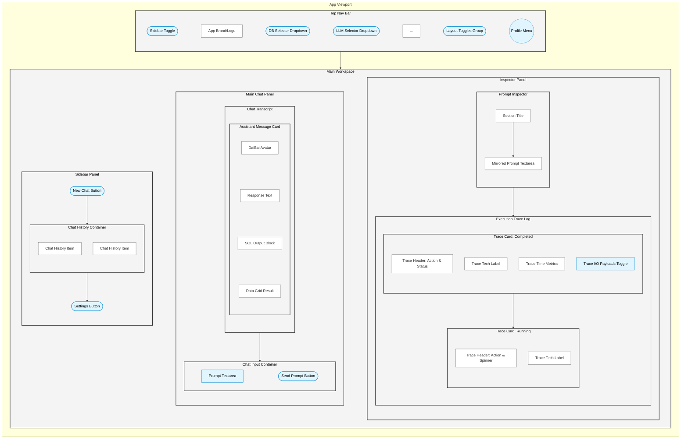

# AI Pane (right navigation)

Here is a comprehensive architectural plan to implement this new interface, using standard UX and frontend terminology.

---

## 1. Visible Layout Architecture (UX)

The layout will transition from a 2-column layout to a **3-column responsive flex layout**.

* **Left Column (Sidebar):** Existing conversation history and navigation.
* **Center Column (Chat Area):** The existing primary interaction zone (where the user types and sees final results).
* **Right Column (Inspector Pane):** The new collapsible context window taking up ~25% of the viewport width.

**Internal Layout of the Inspector Pane:**
The Inspector Pane will use a vertical flexbox (`flex-direction: column`).

* **Top 25% (Prompt Inspector):** A locked-height or flex-basis region containing a `<textarea>`. When a user submits a query in the Chat Area, it is mirrored here.
* **Bottom 75% (Execution Trace):** A scrollable `flex: 1` container. It will display a chronological feed of "Trace Cards" (the AI Brain steps).

---

## 2. Components in the New System

To keep terminology standard, here is what we will call the new elements:

* **`InspectorPane` (`<aside class="inspector-pane">`):** The parent container for the right side.
* **`PromptInspector`:** The top section containing the copied request.
* **`TraceLog` / `ExecutionTrace`:** The bottom scrollable container replacing the "AI Brain Panel" concept.
* **`TraceCard`:** A single UI component within the Trace Log representing one processing step. It will display:
  * *Header:* Action Name & Technology (e.g., "Semantic Pruning • all-MiniLM-L6-v2").
  * *Metrics:* Start time, Stop time, Elapsed duration (ms).
  * *I/O:* Collapsible "Input" and "Output" data payloads.
  * *Status:* Success (Green check), Running (Spinner), or Error (Red X).
* **`LayoutToggles`:** A set of SVG-based buttons to be added to the Profile Menu (or Top Nav) to control pane visibility (e.g., Sidebar Only, Main Only, Main + Inspector, All).

---

## 3. Updates to the Existing System

**Frontend (`index.html`, `styles.css`, `app.js`):**

* **`index.html`:** Add `<aside class="inspector-pane" id="inspectorPane">` inside `.main-container` immediately after `<main class="chat-area">`. Add the layout toggle SVG buttons to the `#profileDropdown`.
* **`styles.css`:** Update `.main-container` to handle three columns smoothly. Add CSS variables for `--inspector-width: 25vw` (with a min-width of ~300px to prevent squishing). Add transition animations for collapsing the right pane (similar to how the left `.sidebar.collapsed` works). Add styling for the `.trace-card` elements.
* **`app.js`:** Add state management for the Layout Toggles (saving preferences to `localStorage`). Update `sendMessage()` to copy `promptInput.value` into the `PromptInspector` text area. **Critical Addition:** Create a new WebSocket message handler. Currently, `app.js` handles `init`, `ack`, `sql`, `results`, `message`, and `error`. We need a new case, `case 'trace':`, which receives step-by-step telemetry from the backend and appends `TraceCard` HTML to the `TraceLog`.

**Backend (`daibai/api/server.py` & `daibai/core/agent.py`):**

* To populate the AI Brain Panel, the Python backend must be updated to stream its internal state. The WebSocket endpoint must emit `{"type": "trace", "step": "schema_pruning", "status": "running", "input": ...}` events *during* the generation process, rather than waiting to send the final `sql` payload.

---

## 4. Sample Screen Architecture

```text
+---------------------------------------------------------------------------------+
| [=] DaiBai | Database [v] | LLM [v]           [Layout Toggles ◧ ◨ ▦] (Avatar) |
+------------------+--------------------------------------+-----------------------+
| + New Chat       |                                      | PROMPT INSPECTOR      |
|                  |     [DaiBai Avatar]                  | +-------------------+ |
| Chat History 1   |     Here are your results:           | | get me the top 10 | |
| Chat History 2   |     [SQL Block]                      | | accounts in terms | |
|                  |     [Data Table]                     | | of comments       | |
|                  |                                      | +-------------------+ |
|                  |                                      |-----------------------|
|                  |                                      | EXECUTION TRACE       |
|                  |                                      |                       |
|                  |                                      | [v] Semantic Prune    |
|                  |                                      |   Tech: MiniLM-L6     |
|                  |  +--------------------------------+  |   Time: 45ms          |
|                  |  | Ask me about your database...|>|  |                       |
|                  |  +--------------------------------+  | [>] SQL Generation    |
|                  |                                      |   Tech: Gemini 2.5    |
| [Settings]       |                                      |   Status: Running...  |
+------------------+--------------------------------------+-----------------------+
```

---

## 5. Level of Effort

* **Frontend UI/UX (Layout & Styling):** **Low/Medium**. Flexbox makes adding a collapsible right pane very straightforward. The CSS for the trace cards is standard UI work.
* **Frontend Logic (JavaScript):** **Low**. Handling the toggles, copying the text, and appending JSON data to the DOM via WebSocket is minimal effort.
* **Backend Telemetry (Python):** **High**. This is the heaviest lift. The `DaiBaiAgent` and `GuardrailPipeline` currently execute synchronously in a single block. They will need to be instrumented to yield or await WebSocket broadcast messages at the start and end of every major sub-routine (Pruning, Validation, LLM Call, Execution) so the UI has data to display.

---

## 6. Effort Plan (Instructions for Cursor)

When you are ready to build this, you can feed these phases to Cursor's Composer one by one.

### Phase 1: The UI Skeleton & Layout Controls

> **Prompt for Cursor:** "In `index.html` and `styles.css`, add a third column to the `.main-container` called `<aside class="inspector-pane" id="inspectorPane">`. It should sit to the right of `.chat-area` and take up 25% of the width (`min-width: 320px`). Inside it, create two vertical flex sections: a top section (25% height) containing a `<textarea id="promptInspector">`, and a bottom section (`flex: 1`, scrollable) with `id="executionTrace"`. In `styles.css`, add a `.inspector-pane.collapsed` class that hides it smoothly by sliding it out to the right. Finally, in the top nav `#profileDropdown` area, add 3 SVG icon buttons to toggle layout views (Left Only, Right Only, Both)."

### Phase 2: Frontend State & Prompt Mirroring

> **Prompt for Cursor:** "In `app.js`, bind the new layout toggle buttons to add/remove the `.collapsed` classes on `#sidebar` and `#inspectorPane`. Save these layout states to `localStorage` in the `savePreferences()` method. Next, update the `sendMessage()` function so that when a user sends a query, the exact text is copied into the `promptInspector` textarea."

### Phase 3: Building the Trace Card Component

> **Prompt for Cursor:** "In `app.js`, create a new method `renderTraceStep(traceData)`. This function should create an HTML card and append it to `#executionTrace`. The `traceData` object will look like: `{ step_name: 'SQL Gen', tech: 'Gemini', duration_ms: 120, input: '{...}', output: '{...}', status: 'success' }`. Build a clean UI for this card in `styles.css` using our existing CSS variables. Hook this up to the `handleWebSocketMessage` function by adding a `case 'trace':` switch block that calls `renderTraceStep(data.content)`."

### Phase 4: Backend Instrumentation (Crucial Step)

> **Prompt for Cursor:** "In `daibai/core/agent.py` and `daibai/api/server.py`, we need to stream execution telemetry to the frontend WebSocket. Modify the `generate_sql_async` and `run_sql_async` flows. Before calling semantic pruning, emit a WS message of type 'trace' with status 'running'. After pruning completes, emit another 'trace' message with the duration, input query, and output tables. Repeat this pattern for the LLM generation step and the SQL Validation guardrail step."

---

## 7. Component Hierarchy Diagram (Mermaid)

The following Mermaid flowchart represents the spatial layout of the application:



---

## 8. Component Glossary

To make communicating with Cursor (and other developers) seamless, here is the exact nomenclature mapped to the diagram above:

### 1. Top Navigation (TopNavBar)

| Term | Description |
|------|-------------|
| **SidebarToggleBtn** | The hamburger icon to collapse/expand the left sidebar. |
| **AppBrand** | The DaiBai logo and text. |
| **DbSelectorDropdown** | The dropdown to select the active database. |
| **LlmSelectorDropdown** | The dropdown to select the active LLM. |
| **LayoutTogglesGroup** | The new UI controls for the 3-pane layout (Left Only, Main Only, Inspector Only, All, etc.). |
| **UserProfileMenu** | The avatar that opens account settings/logout. |

### 2. Left Column (SidebarPanel)

| Term | Description |
|------|-------------|
| **NewChatBtn** | Initiates a fresh conversation context. |
| **ChatHistoryContainer** | The scrollable wrapper for past chats. |
| **ChatHistoryItem** | A single clickable previous conversation. |
| **SettingsBtn** | Opens the application settings modal. |

### 3. Center Column (MainChatPanel)

| Term | Description |
|------|-------------|
| **ChatTranscript** | The scrollable area containing the conversation feed. |
| **AssistantMessageCard** | The wrapper for DaiBai's response. |
| **SqlOutputBlock** | The code-formatted box showing the generated SQL. |
| **DataGridResult** | The HTML/React table rendering the fetched database rows. |
| **ChatInputContainer** | The sticky footer where the user types. |
| **PromptTextarea** | The main editable text input field. |
| **SendPromptBtn** | The submit/enter button. |

### 4. Right Column (InspectorPanel)

| Term | Description |
|------|-------------|
| **PromptInspector** | The top section of the right pane. |
| **MirroredPromptTextarea** | The read-only (or editable later) box holding the copied prompt. |
| **ExecutionTraceLog** | The scrollable timeline of backend AI processing steps. |
| **TraceCard** | The component representing a single processing step (e.g., Semantic Prune, SQL Gen). |
| **TraceHeader** | Shows the name of the step and a status icon (Check, Spinner, X). |
| **TraceTechLabel** | Shows the model or library used (e.g., MiniLM-L6, Gemini 2.5). |
| **TraceTimeMetrics** | Shows duration (e.g., 45ms). |
| **TracePayloads** | An expandable section showing the raw Input sent to the tool and the Output received. |

---

## 9. Component Reference Table

| Component Name | Parent Container | Description/Role |
|----------------|-----------------|-----------------|
| **TopNavBar** | AppViewport | Top navigation bar containing app branding and global controls. |
| **SidebarToggleBtn** | TopNavBar | Hamburger icon to collapse/expand the left sidebar. |
| **AppBrand** | TopNavBar | The DaiBai logo and text. |
| **DbSelectorDropdown** | TopNavBar | Dropdown to select the active database. |
| **LlmSelectorDropdown** | TopNavBar | Dropdown to select the active LLM. |
| **LayoutTogglesGroup** | TopNavBar | Controls for the 3-pane layout (Left Only, Main Only, Inspector Only, All, etc.). |
| **UserProfileMenu** | TopNavBar | Avatar that opens account settings/logout. |
| **SidebarPanel** | MainWorkspace | Left column container for chat history and settings. |
| **NewChatBtn** | SidebarPanel | Initiates a fresh conversation context. |
| **ChatHistoryContainer** | SidebarPanel | Scrollable wrapper for past chats. |
| **ChatHistoryItem** | ChatHistoryContainer | A single clickable previous conversation. |
| **SettingsBtn** | SidebarPanel | Opens the application settings modal. |
| **MainChatPanel** | MainWorkspace | Center column container for the primary chat interface. |
| **ChatTranscript** | MainChatPanel | Scrollable area containing the conversation feed. |
| **AssistantMessageCard** | ChatTranscript | Wrapper for DaiBai's response. |
| **SqlOutputBlock** | AssistantMessageCard | Code-formatted box showing the generated SQL. |
| **DataGridResult** | AssistantMessageCard | Data table rendering the fetched database rows. |
| **ChatInputContainer** | MainChatPanel | Sticky footer where the user types. |
| **PromptTextarea** | ChatInputContainer | Main editable text input field. |
| **SendPromptBtn** | ChatInputContainer | Submit/enter button. |
| **InspectorPanel** | MainWorkspace | Right column container for AI execution context. |
| **PromptInspector** | InspectorPanel | Top section of the right pane. |
| **MirroredPromptTextarea** | PromptInspector | Box holding the copied prompt. |
| **ExecutionTraceLog** | InspectorPanel | Scrollable timeline of backend AI processing steps. |
| **TraceCard** | ExecutionTraceLog | Component representing a single processing step. |
| **TraceHeader** | TraceCard | Shows the name of the step and a status icon (Check, Spinner, X). |
| **TraceTechLabel** | TraceCard | Shows the model or library used (e.g., MiniLM-L6, Gemini 2.5). |
| **TraceTimeMetrics** | TraceCard | Shows duration of the processing step (e.g., 45ms). |
| **TracePayloads** | TraceCard | Expandable section showing raw Input sent and Output received. |
