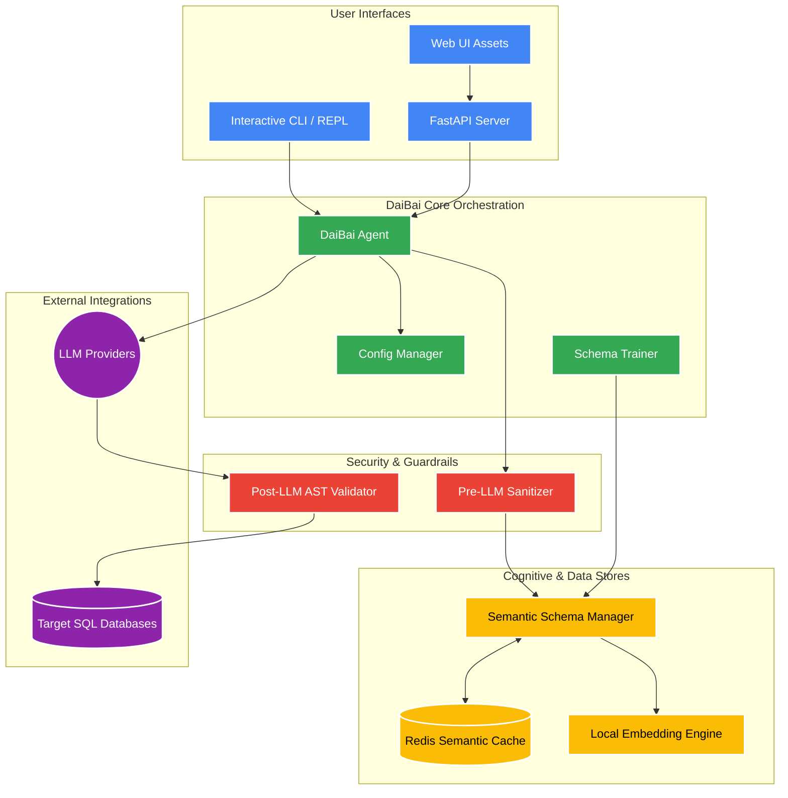
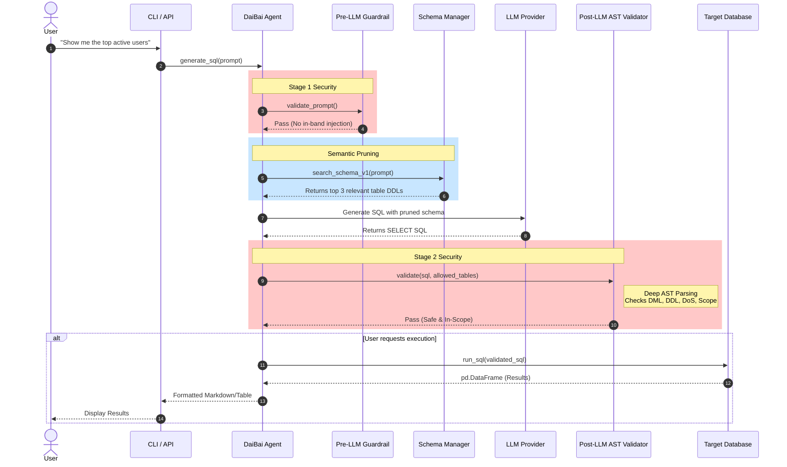
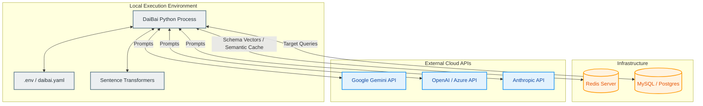

# DaiBai Master Architecture Guide

**Status:** Pre-Containerization (Local/Hybrid Stage)  
**Version:** 1.0.0

This document outlines the architectural views of the DaiBai AI Database Assistant. It maps meticulously to the completed product components prior to containerization and Azure migration. Each diagram is rendered inline for GitHub and IDE viewers; raw Mermaid source files are linked for direct editing and preview in tools like VSCode with Mermaid extensions.

---

## 1. Logical Architecture View

**Primary Consumers:** System Architects, Product Owners  
**Purpose:** Defines the high-level abstract modules, separating the user interface, core orchestration, cognitive services, and data layers.

The logical view shows the major subsystems and their responsibilities. User interfaces (CLI, API, Web UI) all route through the DaiBai Agent, which coordinates configuration, schema training, and security. The Security & Guardrails layer implements two-stage validation: pre-LLM prompt sanitization and post-LLM AST validation. The Cognitive & Data Stores include the Semantic Schema Manager (with Redis and local embeddings) for table pruning. External integrations are LLM providers and target SQL databases.

**[View raw Mermaid file](mermaid/logical_architecture.mmd)**

---

## 2. Execution Sequence & Data Flow (The "Reasoning" Cycle)

**Primary Consumers:** Developers, Security Engineers  
**Purpose:** Illustrates the step-by-step lifecycle of a single natural language query, highlighting semantic pruning and the two-stage guardrail pipeline.

When a user asks a question, the CLI or API forwards it to the Agent. Stage 1 Security checks the prompt for in-band SQL injection (e.g., `UNION SELECT`, `DROP DATABASE`) before any token is sent. Semantic Pruning then retrieves the top-K relevant table DDLs from the Schema Manager, reducing token cost and context noise. The Agent sends the pruned schema to the LLM, which returns SQL. Stage 2 Security validates the generated SQL via AST parsing, blocking DML/DDL, DoS functions, system schema probing, and out-of-scope tables. If the user requested execution, the validated SQL runs against the target database and results are formatted and returned.

**[View raw Mermaid file](mermaid/execution_sequence.mmd)**

---

## 3. Security & Control Surfaces View

**Primary Consumers:** Security Auditors, DevSecOps  
**Purpose:** Maps the specific attack vectors mitigated by the GuardrailPipeline and SQLValidator to prove the "Safe-by-Design" architecture.

User input is treated as untrusted. The Pre-LLM Sanitizer applies regex-based checks for UNION smuggling, in-band DML/DDL, and tautology patterns. Only prompts that pass reach the LLM. The generated SQL then flows through the Post-LLM AST Validator, which performs lexical blocking of DML/DDL keywords, system schema probing, DoS functions, out-of-scope table access, and multi-statement piggyback attacks. Any failure at either stage raises `SecurityViolation` and halts the request. The database is only reached when both stages pass.

```mermaid
flowchart LR
    classDef threat fill:#ea4335,stroke:#fff,stroke-width:2px,color:#fff;
    classDef shield fill:#34a853,stroke:#fff,stroke-width:2px,color:#fff;
    classDef safe fill:#4285f4,stroke:#fff,stroke-width:2px,color:#fff;

    Input[/User Prompt/]:::threat

    subgraph Pre_LLM [Stage 1: Pre-LLM Sanitizer]
        Regex1[UNION Smuggling Check]:::shield
        Regex2[In-band DML/DDL Block]:::shield
        Regex3[Tautology Regex]:::shield
    end

    LLM((LLM Generation)):::safe

    subgraph Post_LLM [Stage 2: Post-LLM AST Validator]
        AST1[Lexical DML/DDL Block]:::shield
        AST2[System Schema Probing Block]:::shield
        AST3[DoS Functions Block]:::shield
        AST4[Out-of-Scope Table Block]:::shield
        AST5[Multi-Statement Piggyback Check]:::shield
    end

    TargetDB[(SQL Database)]:::safe

    Input --> Pre_LLM
    Regex1 & Regex2 & Regex3 -->|Pass| LLM
    LLM --> Post_LLM
    AST1 & AST2 & AST3 & AST4 & AST5 -->|Pass| TargetDB

    Pre_LLM -.->|Fail| Reject1[SecurityViolation]:::threat
    Post_LLM -.->|Fail| Reject2[SecurityViolation]:::threat
```

**[View raw Mermaid file](mermaid/security_surfaces.mmd)**

---

## 4. Physical / Deployment Architecture (Current Hybrid State)

**Primary Consumers:** DevOps, System Administrators  
**Purpose:** Shows where components currently reside physically prior to full Azure Container Apps migration. Local processes connect to local/cloud databases and external SaaS APIs.

The DaiBai Python process runs on a local workstation. It reads configuration from `.env` and `daibai.yaml` and loads the Sentence Transformers embedding model locally. Redis (local or Azure-hosted) stores schema vectors and semantic cache entries. Target SQL databases (MySQL, PostgreSQL) may be local or remote. LLM providers (Gemini, OpenAI, Anthropic) are cloud SaaS APIs. This hybrid model supports development and small deployments; the next step is containerization for immutable deployment to Azure.

**[View raw Mermaid file](mermaid/deployment_architecture.mmd)**

---

## Readiness for Containerization

All logical components, environment variables, and data flows are documented. The next step is to create the multi-stage Dockerfile and `docker-compose.yml` to bundle the Local Execution Environment into an immutable artifact, ready for Azure Container Apps migration.
