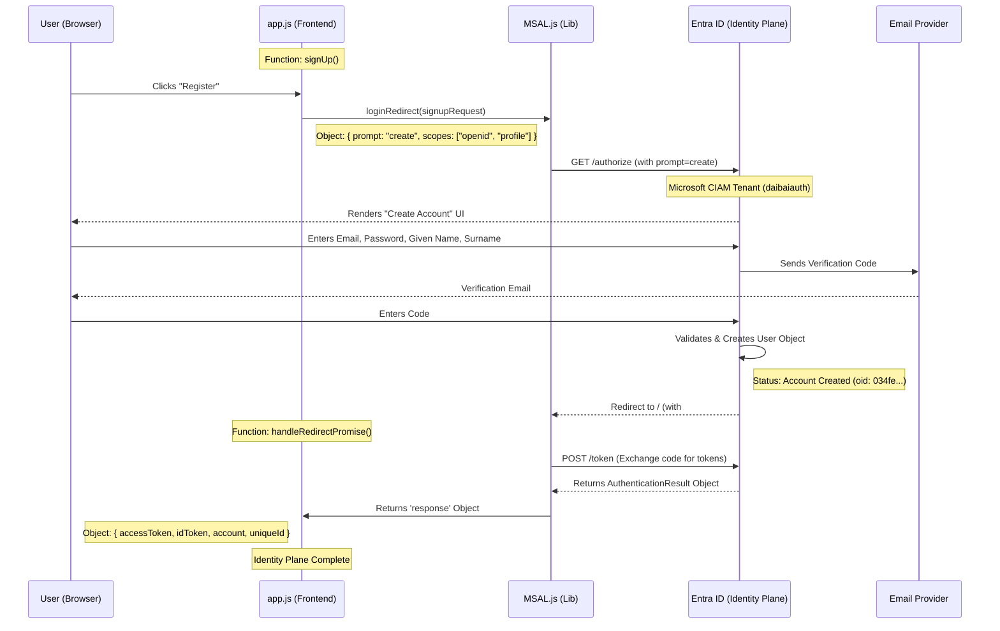

| Step | Component | Code Location | Function / Event | Object Transferred | **Resource Created / Modified** | **Narrative** |
| :--- | :--- | :--- | :--- | :--- | :--- | :--- |
| **1** | **User Interface** | `index.html` | `onclick` | N/A | Browser UI Event | User clicks "Register" on the DaiBai Auth Gate. |
| **2** | **Frontend Logic** | `app.js` | `signUp()` | `signupRequest` | Session Storage (MSAL State) | App sets `prompt: "create"` to trigger the registration workflow. |
| **3** | **MSAL Library** | `msal-browser.js` | `loginRedirect()` | Auth URL (GET) | Browser Navigation State | MSAL redirects the browser to the `daibaiauth` Microsoft cloud endpoint. |
| **4** | **Azure Entra** | CIAM Tenant | User Flow | HTML UI | Temporary Auth Session | Azure renders the signup form and collects Given Name, Surname, and Email. |
| **5** | **Identity Verify** | SMTP / Azure | OTP Validation | 6-Digit Code | Verified Verification Ticket | The user proves they own the email; Azure marks the session as "Verified." |
| **6** | **Cloud Provision** | **Entra Directory** | **User Creation** | **`UserObject`** | **L: "Ghost User (unknown)" in Entra Users Repo** | **GHOST CREATED:** Azure commits the record to its DB. It is a "Ghost" because it has no link to your Data Plane yet. |
| **7** | **Auth Callback** | `app.js` | `onLoad` | URL Hash | Local Storage (Tokens) | The user is sent back to your site. MSAL parses the tokens containing the new `oid`. |
| **8** | **Data Handover** | `app.js` | `fetch('/onboard')` | `accessToken` | HTTP Request Payload | The Frontend sends the new identity to your Python backend to "Hunt the Ghost." |
| **9** | **Robot Lookup** | `auth.py` | `onboard_user()` | MS Graph Query | OAuth2 Client Credentials Token | The **Robot User** (Service Principal) asks Azure: "Who is this new `oid`?" |
| **10** | **Data Resolve** | **CosmosDB** | **Upsert User** | **`UserDocument`** | **L: "Real User (John Doe)" in CosmosDB Users Container** | **GHOST RESOLVED:** The backend saves the real name/email into your DB, linking the `oid` to a real person. |
| **11** | **UI Sync** | `app.js` | `loadSettings()` | JSON Config | Browser DOM (Header/Sidebar) | **RENDERING:** The GUI replaces "unknown" with the real name from your database. |

# Key Data Objects

The signupRequest (Sent to Azure):

```JSON
{
  "scopes": ["openid", "profile", "User.Read"],
  "extraQueryParameters": { "prompt": "create" }
}
```  
The *response* (Received from Azure):

- *uniqueId* (oid): The permanent ID for the user (e.g., 034fe1ff...).

- *idTokenClaims*: Contains the name, surname, and email collected during step 3.

- *accessToken*: The "Key" used to talk to the Data Plane (next phase).

Next Step: Since the Identity Plane is now complete, would you like me to write the sequence diagram for the Data Plane (Onboarding) flow, which shows how the "Robot User" actually saves this data to CosmosDB?