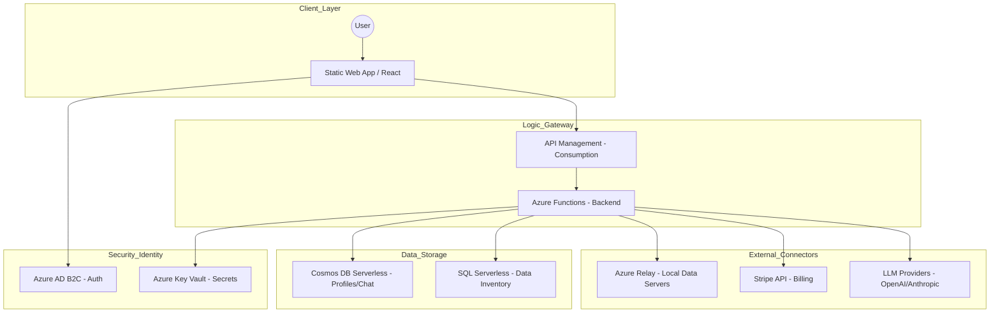
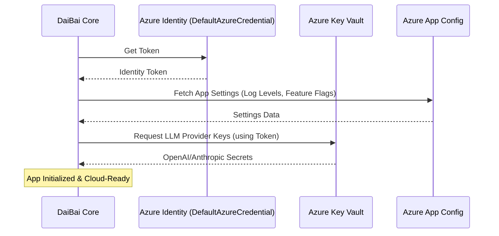

# DaiBai Azure Serverless Hosting Strategy

This document outlines the architecture, costing, and roadmap for deploying DaiBai on Azure using a "super-cheap" serverless model designed to scale from 1 to 10,000+ users.

## 1. Comprehensive Architecture

The architecture utilizes a consumption-based model where you only pay for active execution and data storage.

### Architecture Diagram

*[Mermaid source: [docs/mermaid/azure2-architecture.mmd](mermaid/azure2-architecture.mmd)]*

### Component Breakdown

| Component | Description |
|-----------|-------------|
| **Azure Static Web Apps** | Hosts the frontend with a free tier for hobbyists and a global CDN. |
| **Azure Functions (Python)** | Replaces the FastAPI server.py with serverless logic that scales to zero when idle. |
| **Azure AD B2C** | Provides secure user management (Free for first 50k monthly active users). |
| **Azure Key Vault** | Centralized storage for user-provided LLM keys and system database credentials. |
| **Azure Cosmos DB (Serverless)** | Stores chat history and agent metadata with pay-per-request pricing. |
| **Azure Relay/Hybrid Connections** | Enables the serverless cloud backend to securely query "local" data servers behind firewalls without VPNs. |

## 2. Costing Analysis (Monthly Estimates)

Estimates are based on typical consumption patterns for a serverless environment.

| Users | Compute (Functions) | Data (Cosmos/SQL) | Security (B2C/Vault) | Total Est./Mo |
|-------|----------------------|-------------------|----------------------|---------------|
| 1 | $0.00 (Free Grant) | $0.05 | $0.00 | **~$0.05 - $1.00** |
| 10 | $0.00 (Free Grant) | $0.50 | $0.00 | **~$5.00** |
| 100 | $5.00 | $15.00 | $1.00 | **~$21.00** |
| 1,000 | $45.00 | $120.00 | $10.00 | **~$175.00** |
| 10,000 | $400.00 | $900.00+ | $50.00 | **~$1,350.00+** |

## 3. Automated Migration Roadmap

| Phase | Description |
|-------|-------------|
| **Phase 1: Environment Abstraction** | Modify config.py to support DefaultAzureCredential for seamless local-to-cloud transition. Transition local .env variables to Azure App Configuration. |
| **Phase 2: Infrastructure as Code (IaC)** | Develop Bicep templates to automate the provisioning of the entire resource stack. |
| **Phase 3: CI/CD Pipeline** | Establish GitHub Actions to automate deployments directly to Azure Static Web Apps and Azure Functions. |
| **Phase 4: Billing & Metering** | Implement usage tracking within the Python logic to report "tokens used" or "tasks completed" to the Stripe Gateway. |

### <u>Phase 1: Environment Abstraction & Cloud-Ready Refactoring</u>

Phase 1 focuses on decoupling the DaiBai core logic from local file-based configurations and secrets, making the codebase "cloud-aware" without breaking local development.

#### Goal

*Transition from local `.env` and `daibai.yaml` files to a secure, centralized identity-based configuration system using **Azure App Configuration** and **Azure Key Vault**.*

#### Technical Tasks

**A. Managed Identity Integration**

- **Implement Managed Identity:** Update `daibai/core/config.py` to use `DefaultAzureCredential` from the `azure-identity` library. This allows the app to authenticate to Azure services without storing local service principal keys.
- **Conditional Loading:** Modify the configuration loader to check for an environment variable (e.g., `AZURE_DEPLOYMENT=true`). If false, it defaults to the existing `dotenv` and YAML loading logic to preserve local dev functionality.

**B. Secrets Externalization (Key Vault)**

- **LLM Key Migration:** Move all provider keys (OpenAI, Anthropic, Gemini, etc.) from the `.env` file into **Azure Key Vault**.
- **Code Refactor:** Update the `Config` class in `daibai/core/config.py` to fetch secrets dynamically from the Key Vault URI during runtime rather than reading from `os.getenv` at startup.

**C. Database Connection Abstraction**

- **Connection String Mapping:** Update `daibai/core/agent.py` to support dynamic connection string retrieval. Instead of reading static strings from a local file, the agent should query the **Azure SQL Serverless** (Data Inventory) for the metadata of the requested data server.
- **Azure Relay Integration (PoC):** Introduce the `azure-relay-bridge` for local database access. Refactor the database connection logic in the agent to route through a local relay listener if the target server is marked as "On-Premise".

**D. API Server Adaption**

- **FastAPI to Azure Functions:** Create a wrapper for `daibai/api/server.py` using `azure-functions-python-library`.
- **Stateless Transition:** Ensure all session-specific data currently stored in memory within `server.py` is moved to a distributed cache (Azure Cache for Redis) or the serverless Cosmos DB instance to support horizontal scaling.

#### Implementation Diagram

*[Mermaid source: [docs/mermaid/azure2-phase1.mmd](mermaid/azure2-phase1.mmd)]*

#### Success Criteria

- [ ] The application starts successfully on a local machine without an .env file (using Azure CLI logged-in credentials).
- [ ] `daibai/core/config.py` no longer contains hardcoded fallbacks for sensitive keys.
- [ ] The application can retrieve at least one "Remote" database connection string from Azure Key Vault and successfully run a query via `daibai/core/agent.py`.

#### Sources Used

- `daibai/core/config.py` (Local config logic)
- `daibai/core/agent.py` (Database orchestration logic)
- `daibai/api/server.py` (API/Backend structure)
- Previous Architecture Analysis (Azure service mapping)

## 4. Outstanding Items (Beyond Architecture)

- **Multi-Tenancy Logic:** Ensure the database schema and API endpoints isolate data so users cannot see each other's local server configurations.
- **BYOK (Bring Your Own Key) Support:** Implement a secure UI for users to store their own Anthropic/OpenAI keys in an encrypted per-user vault.
- **Stripe Webhook Integration:** Build handlers for subscription lifecycle events (payment success, cancellation, credit exhaustion).
- **Local Agent Binary:** Create a lightweight "Relay Agent" that users can install locally to bridge their local data servers to the Azure cloud.
- **Telemetry & Audit:** Implement Azure Monitor/Application Insights to track failed queries and agent performance across different LLM providers.
