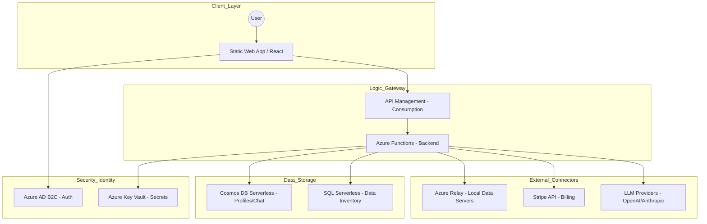
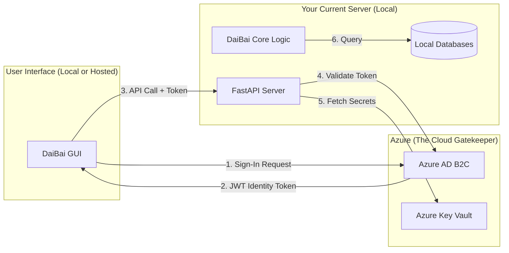
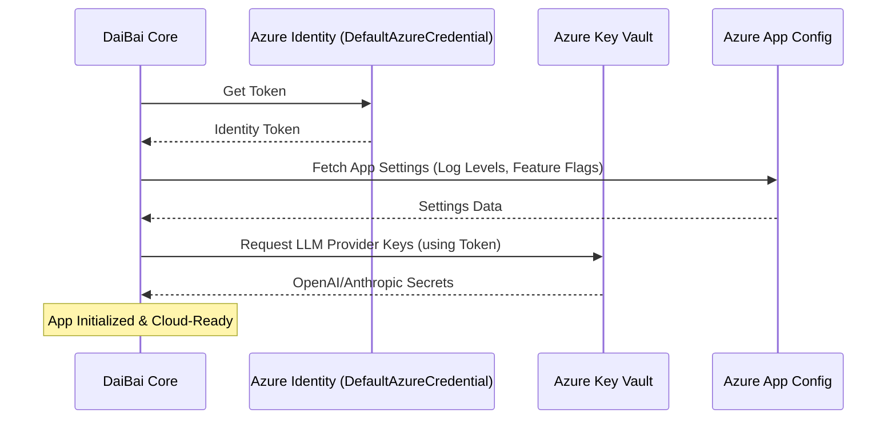
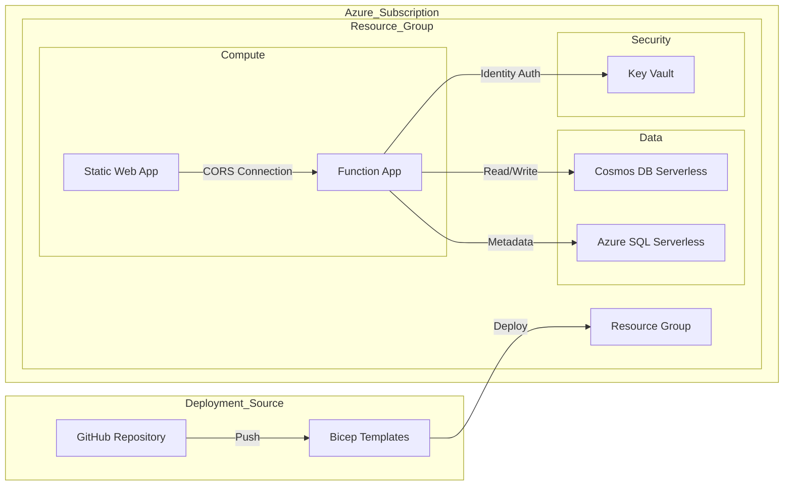
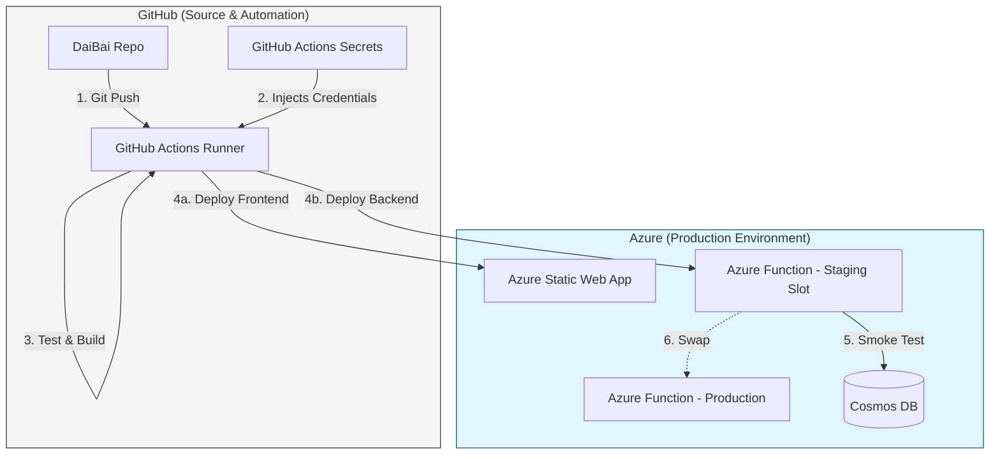
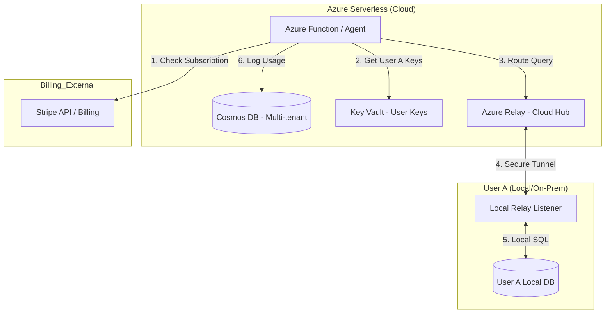

# DaiBai Azure Serverless Hosting Strategy

This document outlines the architecture, costing, and roadmap for deploying DaiBai on Azure using a "super-cheap" serverless model designed to scale from 1 to 10,000+ users.

## 1. Comprehensive Architecture

The architecture utilizes a consumption-based model where you only pay for active execution and data storage.

### Architecture Diagram


```mermaid
graph TD
    subgraph Client_Layer
        User((User))
        GUI[Static Web App / React]
    end

    subgraph Security_Identity
        B2C[Azure AD B2C - Auth]
        Vault[Azure Key Vault - Secrets]
    end

    subgraph Logic_Gateway
        APIM[API Management - Consumption]
        AF[Azure Functions - Backend]
    end

    subgraph Data_Storage
        Cosmos[Cosmos DB Serverless - Profiles/Chat]
        SQL[SQL Serverless - Data Inventory]
    end

    subgraph External_Connectors
        Relay[Azure Relay - Local Data Servers]
        Stripe[Stripe API - Billing]
        LLM[LLM Providers - OpenAI/Anthropic]
    end

    User --> GUI
    GUI --> B2C
    GUI --> APIM
    APIM --> AF
    AF --> Vault
    AF --> Cosmos
    AF --> SQL
    AF --> Relay
    AF --> Stripe
    AF --> LLM
```

*[Mermaid source: [docs/mermaid/azure2-architecture.mmd](mermaid/azure2-architecture.mmd)]*

### Component Breakdown

| Component | Description |
|-----------|-------------|
| **Azure Static Web Apps** | Hosts the frontend with a free tier for hobbyists and a global CDN. |
| **Azure Functions (Python)** | Replaces the FastAPI server.py with serverless logic that scales to zero when idle. |
| **Azure AD B2C** | Provides secure user management (Free for first 50k monthly active users). |
| **Azure Key Vault** | Centralized storage for user-provided LLM keys and system database credentials. |
| **Azure Cosmos DB (Serverless)** | Stores chat history and agent metadata with pay-per-request pricing. |
| **Azure Relay/Hybrid Connections** | Enables the serverless cloud backend to securely query "local" data servers behind firewalls without VPNs. |

## 2. Costing Analysis (Monthly Estimates)

Estimates are based on typical consumption patterns for a serverless environment.

| Users | Compute (Functions) | Data (Cosmos/SQL) | Security (B2C/Vault) | Total Est./Mo |
|-------|----------------------|-------------------|----------------------|---------------|
| 1 | $0.00 (Free Grant) | $0.05 | $0.00 | **~$0.05 - $1.00** |
| 10 | $0.00 (Free Grant) | $0.50 | $0.00 | **~$5.00** |
| 100 | $5.00 | $15.00 | $1.00 | **~$21.00** |
| 1,000 | $45.00 | $120.00 | $10.00 | **~$175.00** |
| 10,000 | $400.00 | $900.00+ | $50.00 | **~$1,350.00+** |

## 3. Automated Migration Roadmap

| Phase | Description |
|-------|-------------|
| **Phase 1: Environment Abstraction** | Modify config.py to support DefaultAzureCredential for seamless local-to-cloud transition. Transition local .env variables to Azure App Configuration. |
| **Phase 2: Infrastructure as Code (IaC)** | Develop Bicep templates to automate the provisioning of the entire resource stack. |
| **Phase 3: CI/CD Pipeline** | Establish GitHub Actions to automate deployments directly to Azure Static Web Apps and Azure Functions. |
| **Phase 4: Billing & Metering** | Implement usage tracking within the Python logic to report "tokens used" or "tasks completed" to the Stripe Gateway. |

### Pre-Phase 1: Identity-First Hybrid Strategy

A recommended "Hybrid" approach: secure your application with enterprise-grade identity management immediately while keeping compute costs at zero by continuing to run the backend on your local machine or existing server.

#### The "Hybrid Identity" Architecture

In this phase, your application remains local, but the "Gatekeeper" (Authentication) is moved to Azure.


```mermaid
graph LR
    subgraph Client_Side["User Interface (Local or Hosted)"]
        UI[DaiBai GUI]
    end

    subgraph Azure_Identity_Layer["Azure (The Cloud Gatekeeper)"]
        B2C[Azure AD B2C]
        AKV[Azure Key Vault]
    end

    subgraph Local_Compute["Your Current Server (Local)"]
        API[FastAPI Server]
        Core[DaiBai Core Logic]
        DB[(Local Databases)]
    end

    %% Flow
    UI -->|1. Sign-In Request| B2C
    B2C -->|2. JWT Identity Token| UI
    UI -->|3. API Call + Token| API
    API -->|4. Validate Token| B2C
    API -->|5. Fetch Secrets| AKV
    Core -->|6. Query| DB
```

*[Mermaid source: [docs/mermaid/azure2-hybrid-identity.mmd](mermaid/azure2-hybrid-identity.mmd)]*

#### Implementation Steps

**Step A: Setup Azure AD B2C**

- **Tenant Creation:** Create a free Azure AD B2C tenant.
- **User Flows:** Define "Sign-up and Sign-in" flows. This provides the login screens without writing any HTML/CSS.
- **App Registration:** Register your DaiBai GUI as a "Single Page Application" and your FastAPI server as a "Web API."

**Step B: Refactor `daibai/api/server.py`**

Currently, `server.py` does not have formal authentication middleware. Add a security dependency:

- **FastAPI Security:** Use `fastapi.security.OAuth2AuthorizationCodeBearer`.
- **Token Validation:** Add a function to verify the JWT (JSON Web Token) sent by the user against your Azure B2C keys. If the token is missing or invalid, the API returns a 401 Unauthorized error.

**Step C: Update `daibai/core/config.py` for "Developer Identity"**

To access Azure services (like Key Vault) from your local machine:

- **Install Azure Identity:** Add `azure-identity` and `azure-keyvault-secrets` to your dependencies.
- **Use DefaultAzureCredential:** Update your config loader to attempt to use `DefaultAzureCredential()`.
- **Local Login:** Run `az login` on your local terminal. When your local `config.py` runs, it will use your identity to securely pull LLM keys from Azure Key Vault instead of reading them from a plain-text `.env` file.

#### Benefits of this Phased Approach

| Benefit | Description |
|---------|-------------|
| **Zero Infrastructure Cost** | The API and Agent still run on your hardware; no Azure Functions or App Service costs yet. |
| **Security Jumpstart** | LLM keys and database credentials are removed from local files and moved into Key Vault immediately. |
| **User Management** | Create user accounts and track usage because every request has a unique User ID. |
| **Seamless Final Migration** | Once working, full Azure migration is moving your code into an Azure Function; security and config logic stay the same. |

#### Prerequisites

- **Azure Subscription:** Pay-As-You-Go subscription (B2C has a free tier of 50,000 users).
- **Secret Audit:** Review `daibai.yaml.example` and `.env.example`—these are the values to move into Azure Key Vault first.

#### Azure Environment Reference

**Microsoft Entra Directory**

| Property | Value |
|----------|-------|
| **Directory Name** | DaiBai Customers |
| **Domain** | daibaiauth.onmicrosoft.com |
| **Directory (Tenant) ID** | `e12adb01-a6b3-47bb-86c0-d662dacb3675` |

**Application Registration: DaiBai-GUI**

| Property | Value |
|----------|-------|
| **Display Name** | DaiBai-GUI |
| **Application (client) ID** | `5f5462c3-47b1-4af0-9ee0-6271d9893780` |
| **Object ID** | `a8857d43-d6d1-48b2-a02b-30a0e32a8198` |
| **Directory (tenant) ID** | `e12adb01-a6b3-47bb-86c0-d662dacb3675` |
| **Supported account types** | My organization only |
| **Redirect URIs** | 1 SPA (configure as needed) |
| **State** | Activated |

**Application Registration: DaiBai-API**

| Property | Value |
|----------|-------|
| **Display Name** | DaiBai-API |
| **Application (client) ID** | `0d959490-bf5b-49f4-b7d2-97e4d3ff8c0d` |
| **Object ID** | `881fd2dd-ea73-4120-a618-1da921149c91` |
| **Directory (tenant) ID** | `e12adb01-a6b3-47bb-86c0-d662dacb3675` |
| **Supported account types** | My organization only |
| **Redirect URIs** | Add as needed |
| **State** | Activated |

*Note: Add a certificate or secret for client credentials, and configure the Application ID URI as needed for your API.*

*Use Microsoft Authentication Library (MSAL) and Microsoft Graph. ADAL and Azure AD Graph are deprecated. See [Microsoft Entra External ID](https://learn.microsoft.com/en-us/entra/external-id/) documentation.*

#### Microsoft Entra Identity: Login, Sign-Up & Credentials

DaiBai uses **Microsoft Entra External ID** (formerly Azure AD B2C for customers) to manage user identity. Entra provides login, self-service sign-up, and secure credential handling without storing passwords in the application.

**Identity Model**

| Aspect | Implementation |
|--------|----------------|
| **Provider** | Microsoft Entra External ID (CIAM) |
| **Tenant** | DaiBai Customers (`daibaiauth.onmicrosoft.com`) |
| **Library** | MSAL.js Browser SDK 2.35.0 |
| **Token Storage** | `sessionStorage` (cleared when tab closes) |

**Login Flow**

1. User clicks **Login** in the nav bar.
2. `signIn()` calls `msalInstance.loginPopup()` with scopes `['openid', 'profile']`.
3. A popup opens to `https://daibaiauth.ciamlogin.com` where the user enters email and password.
4. Entra validates credentials and returns an ID token and account object.
5. MSAL caches the session in `sessionStorage`.
6. The UI switches to show **Sign Out** and hides Login/Register.

**Sign-Up (Registration) Flow**

1. User clicks **Register** in the nav bar.
2. `signUp()` calls `msalInstance.loginPopup()` with the same authority as login.
3. Entra External ID uses a single **Sign-up and sign-in** user flow. If the user has no account, the flow shows the registration form (email verification, password creation, etc.).
4. After successful registration, the user is logged in automatically.
5. New users appear in the **Users** blade in the Microsoft Entra admin center.

*Note: Entra External ID does not use separate B2C-style policy paths (e.g. `B2C_1_signup`). The same authority handles both login and registration.*

**Credentials & Token Management**

- **No passwords in app:** Passwords are never stored or handled by DaiBai. Entra manages authentication.
- **ID tokens:** MSAL receives JWT ID tokens proving the user's identity. These are cached in `sessionStorage`.
- **Access tokens:** For API calls (e.g. Microsoft Graph), `getTokenPopup()` acquires access tokens:
  - Tries `acquireTokenSilent()` first (no popup).
  - Falls back to `acquireTokenPopup()` if interaction is required (e.g. consent, re-auth).
- **Logout:** `signOut()` calls `logoutPopup()`, which clears the Entra session and MSAL cache.

**Configuration (app.js)**

```javascript
// Authority must include tenant ID for Entra External ID
authority: 'https://daibaiauth.ciamlogin.com/e12adb01-a6b3-47bb-86c0-d662dacb3675/'

// Required: ciamlogin.com is not trusted by default
knownAuthorities: ['https://daibaiauth.ciamlogin.com']
```

**UI Components**

| Button | Location | Action |
|--------|----------|--------|
| Login | Nav bar (right) | Opens login popup |
| Register | Nav bar (right) | Opens sign-up/sign-in flow (registration for new users) |
| Sign Out | Nav bar (right) | Logs out and clears session |

**Future: API Integration**

When the FastAPI backend is secured (Phase 1), the frontend will:

1. Call `getTokenPopup({ scopes: ['api://DaiBai-API/access'] })` to obtain an access token for the DaiBai-API app.
2. Send the token in the `Authorization: Bearer <token>` header on each API request.
3. The backend will validate the JWT against Entra's OIDC metadata before processing requests.

### Phase 1: Environment Abstraction & Cloud-Ready Refactoring

Phase 1 focuses on decoupling the DaiBai core logic from local file-based configurations and secrets, making the codebase "cloud-aware" without breaking local development.

#### Goal

*Transition from local `.env` and `daibai.yaml` files to a secure, centralized identity-based configuration system using **Azure App Configuration** and **Azure Key Vault**.*

#### Technical Tasks

**A. Managed Identity Integration**

- **Implement Managed Identity:** Update `daibai/core/config.py` to use `DefaultAzureCredential` from the `azure-identity` library. This allows the app to authenticate to Azure services without storing local service principal keys.
- **Conditional Loading:** Modify the configuration loader to check for an environment variable (e.g., `AZURE_DEPLOYMENT=true`). If false, it defaults to the existing `dotenv` and YAML loading logic to preserve local dev functionality.

**B. Secrets Externalization (Key Vault)**

- **LLM Key Migration:** Move all provider keys (OpenAI, Anthropic, Gemini, etc.) from the `.env` file into **Azure Key Vault**.
- **Code Refactor:** Update the `Config` class in `daibai/core/config.py` to fetch secrets dynamically from the Key Vault URI during runtime rather than reading from `os.getenv` at startup.

**C. Database Connection Abstraction**

- **Connection String Mapping:** Update `daibai/core/agent.py` to support dynamic connection string retrieval. Instead of reading static strings from a local file, the agent should query the **Azure SQL Serverless** (Data Inventory) for the metadata of the requested data server.
- **Azure Relay Integration (PoC):** Introduce the `azure-relay-bridge` for local database access. Refactor the database connection logic in the agent to route through a local relay listener if the target server is marked as "On-Premise".

**D. API Server Adaption**

- **FastAPI to Azure Functions:** Create a wrapper for `daibai/api/server.py` using `azure-functions-python-library`.
- **Stateless Transition:** Ensure all session-specific data currently stored in memory within `server.py` is moved to a distributed cache (Azure Cache for Redis) or the serverless Cosmos DB instance to support horizontal scaling.

#### Implementation Diagram


```mermaid
sequenceDiagram
    participant App as DaiBai Core
    participant Cred as Azure Identity (DefaultAzureCredential)
    participant KV as Azure Key Vault
    participant Config as Azure App Config

    App->>Cred: Get Token
    Cred-->>App: Identity Token
    App->>Config: Fetch App Settings (Log Levels, Feature Flags)
    Config-->>App: Settings Data
    App->>KV: Request LLM Provider Keys (using Token)
    KV-->>App: OpenAI/Anthropic Secrets
    Note over App: App Initialized & Cloud-Ready
```

*[Mermaid source: [docs/mermaid/azure2-phase1.mmd](mermaid/azure2-phase1.mmd)]*

#### Success Criteria

- [ ] The application starts successfully on a local machine without an .env file (using Azure CLI logged-in credentials).
- [ ] `daibai/core/config.py` no longer contains hardcoded fallbacks for sensitive keys.
- [ ] The application can retrieve at least one "Remote" database connection string from Azure Key Vault and successfully run a query via `daibai/core/agent.py`.

#### Sources Used

- `daibai/core/config.py` (Local config logic)
- `daibai/core/agent.py` (Database orchestration logic)
- `daibai/api/server.py` (API/Backend structure)
- Previous Architecture Analysis (Azure service mapping)

### <u>Phase 2: Infrastructure as Code (IaC) & Automated Provisioning</u>

Phase 2 transitions the project from manual configuration to a "Single-Command Deployment" model. This phase ensures that the entire serverless stack—from security to data storage—is provisioned automatically and consistently.

#### Goal

*Automate the creation and configuration of the Azure environment using **Azure Bicep**, ensuring that all components (Functions, Cosmos DB, Key Vault) are linked with the correct permissions (Least Privilege) from the start.*

#### Technical Implementation Tasks

**A. Template Development (Bicep/Terraform)**

- **Modular Design:** Create reusable Bicep modules for each tier (Storage, Compute, Security) to maintain a clean codebase.
- **Serverless Resource Definition:**
  - **Compute:** Define an `Azure Function App` on a Consumption Plan (Y1) to minimize costs.
  - **Storage:** Define a `Cosmos DB` account explicitly set to **Serverless Mode** (Standard mode incurs hourly costs even without traffic).
  - **Front-End:** Define an `Azure Static Web App` for the React/HTML interface.

**B. Security & Identity Linkage**

- **Role-Based Access Control (RBAC):** Assign the `Key Vault Secrets User` role to the Function App's Managed Identity within the Bicep template.
- **Network Hardening:** Configure the Key Vault to allow access only from the Function App's outbound IP range or via Private Endpoints (if the budget allows for the slightly higher cost of Private Links).

**C. Database Initialization Scripting**

- **Schema Provisioning:** Create a post-deployment script (or use a GitHub Action) to initialize the Cosmos DB containers and Azure SQL (Serverless) tables required for user sessions and Stripe transaction logs.
- **Identity Mapping:** Seed the SQL database with the initial "System" roles required for the DaiBai Agent to begin managing user requests.

#### Infrastructure Flow Diagram


```mermaid
graph LR
    subgraph Deployment_Source
        Git[GitHub Repository]
        Bicep[Bicep Templates]
    end

    subgraph Azure_Subscription
        subgraph Resource_Group
            RG[Resource Group]

            subgraph Security
                AKV[Key Vault]
            end

            subgraph Compute
                AF[Function App]
                SWA[Static Web App]
            end

            subgraph Data
                CDB[Cosmos DB Serverless]
                ASQL[Azure SQL Serverless]
            end
        end
    end

    Git -->|Push| Bicep
    Bicep -->|Deploy| RG
    AF -->|Identity Auth| AKV
    AF -->|Read/Write| CDB
    AF -->|Metadata| ASQL
    SWA -->|CORS Connection| AF
```

*[Mermaid source: [docs/mermaid/azure2-phase2.mmd](mermaid/azure2-phase2.mmd)]*

#### Implementation Checklist

| Task | Description | Status |
|------|-------------|--------|
| Bicep Setup | Initialize main.bicep and modularize resource groups. | [ ] |
| Serverless Locking | Verify Cosmos DB and SQL are locked to "Consumption/Serverless" tiers. | [ ] |
| Managed Identity | Implement system-assigned identity for the Function App. | [ ] |
| Key Vault Scoping | Map specific secrets (Stripe Keys, LLM Keys) to RBAC roles. | [ ] |
| SWA Integration | Link the Static Web App to the Function App API back-end. | [ ] |

#### Success Criteria

- [ ] The entire DaiBai environment can be deployed to a fresh Azure subscription by running `az deployment sub create`.
- [ ] No secrets are stored in the Bicep files (all referenced via Key Vault or parameters).
- [ ] Monthly "Idle Cost" of the provisioned infrastructure remains at $0.00.

### <u>Phase 3: CI/CD Automation & Production-Grade Delivery</u>

Phase 3 focuses on the "Automated Migration" of code from the repository to Azure. By the end of this phase, any change pushed to the GitHub repository will trigger an automated pipeline that tests, builds, and deploys the serverless components and the frontend.

#### Goal

*Establish a robust **GitHub Actions** pipeline that automates the lifecycle of the DaiBai platform, ensuring zero-downtime deployments and high code quality.*

#### Technical Implementation Tasks

**A. GitHub Actions Workflow Configuration**

- **Continuous Integration (CI):** Triggered on every Pull Request to `main`.
  - Runs `pytest` on existing tests (e.g., `tests/test_config.py`, `tests/test_llm_providers.py`).
  - Performs linting and security scanning (Bandit) on the Python core.
- **Continuous Deployment (CD):** Triggered on merges to `main`.
  - **Function App Deploy:** Uses `Azure/functions-action` to deploy the Python backend.
  - **Static Web App Deploy:** Uses the `Azure/static-web-apps-deploy` action to build the `index.html`, `app.js`, and `styles.css` from the `daibai/gui/static/` directory.

**B. Environment Synchronization**

- **Staging vs. Production:** Implement GitHub Environments. Secrets like `STRIPE_API_KEY` and `DATABASE_CONNECTION_STRING` are scoped to specific environments to prevent accidental production overrides during testing.
- **Automated Slot Swapping:** For the Function App, deploy to a "staging" slot first, run smoke tests, then swap to "production" to ensure zero downtime.

**C. Monitoring & Feedback Loops**

- **Azure Monitor / App Insights:** The pipeline automatically injects the `APPINSIGHTS_INSTRUMENTATIONKEY` into the Function App.
- **Alerting:** Configure GitHub to notify the team via Slack/Discord if a deployment fails or if the serverless consumption exceeds a pre-set "Cheap Tier" budget.

#### CI/CD Architecture Diagram


```mermaid
graph TD
    subgraph GitHub_Cloud["GitHub (Source & Automation)"]
        Repo[DaiBai Repo]
        Actions[GitHub Actions Runner]
        Secret[GitHub Actions Secrets]
    end

    subgraph Azure_Cloud["Azure (Production Environment)"]
        direction TB
        SWA[Azure Static Web App]
        AF_Slot[Azure Function - Staging Slot]
        AF_Prod[Azure Function - Production]
        CDB[(Cosmos DB)]
    end

    %% Workflow
    Repo -->|1. Git Push| Actions
    Secret -->|2. Injects Credentials| Actions

    Actions -->|3. Test & Build| Actions

    Actions -->|4a. Deploy Frontend| SWA
    Actions -->|4b. Deploy Backend| AF_Slot

    AF_Slot -->|5. Smoke Test| CDB
    AF_Slot -.->|6. Swap| AF_Prod

    style GitHub_Cloud fill:#f5f5f5,stroke:#333
    style Azure_Cloud fill:#e1f5fe,stroke:#01579b
```

*[Mermaid source: [docs/mermaid/azure2-phase3.mmd](mermaid/azure2-phase3.mmd)]*

#### Implementation Checklist

| Task | Description | Status |
|------|-------------|--------|
| Workflow Setup | Create `.github/workflows/main_deploy.yml`. | [ ] |
| Azure Service Principal | Create a secret `AZURE_CREDENTIALS` for GitHub to talk to Azure. | [ ] |
| Static Web App Token | Link the deployment token for the `daibai/gui/static` folder. | [ ] |
| Function Build | Configure Python dependency installation (pip) in the runner. | [ ] |
| Environment Check | Set up "Production" environment protection in GitHub settings. | [ ] |

#### Success Criteria

- [ ] **Automated Flow:** Pushing a change to `daibai/api/server.py` results in a live API update within 5 minutes without manual intervention.
- [ ] **Validation:** All tests in the `tests/` directory must pass before any code reaches the Azure environment.
- [ ] **Security:** No developers require direct access to the Azure Portal for day-to-day updates.

### <u>Phase 4: Billing Integration, Multi-Tenancy & Hybrid Connectivity</u>

Phase 4 transforms the platform from a hosted tool into a commercial product. This phase focuses on monetization (Stripe), isolating user data (Multi-tenancy), and enabling the "Killer App" feature: querying local on-premise databases from a serverless cloud environment.

#### Goal

*Implement a secure, usage-based billing system and a "Hybrid Relay" that allows the serverless Azure Function to reach into a user's local network to perform data tasks without compromising security.*

#### Technical Implementation Tasks

**A. Stripe Integration (The Gateway)**

- **Metered Billing Logic:** Update `daibai/core/agent.py` to record "Task Units" or "Token Counts" upon completion of a query.
- **Webhook Handler:** Create a new Azure Function endpoint (`/api/webhooks/stripe`) to handle subscription events, payment failures, and credit refills.
- **Usage Reporting:** Implement a background "Sweeper" (Timer-triggered Function) that syncs usage data from Cosmos DB to Stripe every 24 hours.

**B. Logical Multi-Tenancy**

- **Partition Key Strategy:** Update Cosmos DB and SQL Serverless schemas to use `user_id` as the Partition Key. This ensures that a query from "User A" is physically and logically incapable of accessing "User B's" data.
- **Key Vault Scoping:** Implement a "User-Vault" pattern where the app retrieves `BYOK` (Bring Your Own Key) secrets from Key Vault using tags associated with the authenticated B2C user ID.

**C. The Hybrid Relay (Local Data Access)**

- **Azure Relay / Hybrid Connections:** To solve the "Super Cheap" requirement for local data access (avoiding expensive VPN Gateways), implement the Azure Relay bridge.
- **Local Listener:** Provide a small Python script (based on `daibai/cli/`) that the user runs locally. This script opens an outbound connection to the Azure Relay, allowing the Cloud Function to "tunnel" SQL queries down to the local server safely.

#### Product Flow & Multi-Tenancy Diagram


```mermaid
graph TD
    subgraph Azure_Cloud["Azure Serverless (Cloud)"]
        AF[Azure Function / Agent]
        CDB[(Cosmos DB - Multi-tenant)]
        Vault[Key Vault - User Keys]
        RelayH[Azure Relay - Cloud Hub]
    end

    subgraph User_A_Network["User A (Local/On-Prem)"]
        AgentA[Local Relay Listener]
        DB_A[(User A Local DB)]
    end

    subgraph Billing_External
        Stripe[Stripe API / Billing]
    end

    %% Flow
    AF -->|1. Check Subscription| Stripe
    AF -->|2. Get User A Keys| Vault
    AF -->|3. Route Query| RelayH
    RelayH <-->|4. Secure Tunnel| AgentA
    AgentA <-->|5. Local SQL| DB_A
    AF -->|6. Log Usage| CDB
```

*[Mermaid source: [docs/mermaid/azure2-phase4.mmd](mermaid/azure2-phase4.mmd)]*

#### Implementation Checklist

| Task | Description | Status |
|------|-------------|--------|
| Stripe SDK | Integrate `stripe-python` into the backend logic. | [ ] |
| Usage Schema | Design the UsageLogs container in Cosmos DB with TTL (Time To Live). | [ ] |
| B2C Claims | Map `sub` (Subject ID) from B2C tokens to all database queries. | [ ] |
| Relay PoC | Establish a successful "Cloud-to-Local" query using Azure Relay. | [ ] |
| BYOK UI | Add a "Manage Keys" section to the Static Web App frontend. | [ ] |

#### Success Criteria

- [ ] **Monetization:** A user can sign up, enter a credit card, and see their usage reflected in a dashboard.
- [ ] **Privacy:** Database query logs for User A are strictly invisible to User B.
- [ ] **Hybrid Reach:** The system successfully queries a PostgreSQL/SQL Server instance running on a developer's local laptop via the Azure cloud interface.
- [ ] **Cost:** The Azure Relay usage stays within the "Standard" tier (approx. $10/mo), keeping the base cost extremely low.

## 4. Outstanding Items (Beyond Architecture)

- **Multi-Tenancy Logic:** Ensure the database schema and API endpoints isolate data so users cannot see each other's local server configurations.
- **BYOK (Bring Your Own Key) Support:** Implement a secure UI for users to store their own Anthropic/OpenAI keys in an encrypted per-user vault.
- **Stripe Webhook Integration:** Build handlers for subscription lifecycle events (payment success, cancellation, credit exhaustion).
- **Local Agent Binary:** Create a lightweight "Relay Agent" that users can install locally to bridge their local data servers to the Azure cloud.
- **Telemetry & Audit:** Implement Azure Monitor/Application Insights to track failed queries and agent performance across different LLM providers.
