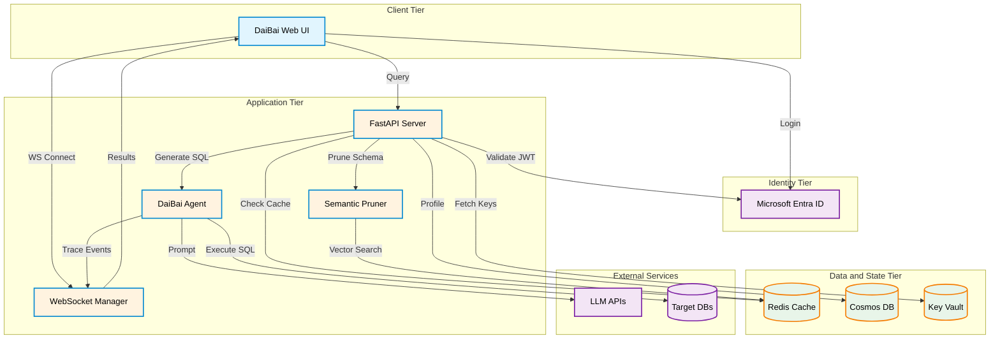

Based on the extensive codebase, architectural markdown files, recent enhancements (like the Inspector Panel/WebSocket telemetry), and your strict "ultra-price-sensitive" constraint, I have designed a highly optimized Azure migration architecture.

To meet the requirement of supporting 1-500 users while cutting every possible cost (sacrificing horizontal scaling, advanced network isolation, and extreme speeds), we must deviate from standard "Enterprise" Azure reference architectures (which rely heavily on expensive services like Azure Front Door, AKS, Managed Redis, and Private Endpoints).

Instead, we will utilize **"Scrooge-Tier" Azure PaaS / IaaS configurations**, maximizing Free Tiers and consolidating workloads.

---

# DaiBai Azure Migration: End-State Architecture (Cost-Optimized)

## **1. Executive Summary & Core Strategies**

This architecture supports the DaiBai Natural Language-to-SQL system for a small to medium user base (1-500 users).

**Extreme Cost-Cutting Measures Applied:**

1. **Consolidated Compute:** We will bypass expensive managed services (like Azure Cache for Redis @ $16+/mo) and instead run Redis alongside the FastAPI application in a single deployment footprint.  
2. **Free Tier Maximization:** We will lock Cosmos DB to the "Free Tier Account" (guaranteed 1000 RU/s and 25GB free forever).  
3. **Public Endpoints with IP Restrictions:** We will NOT use Azure Private Link / VNet integration. Private endpoints cost \~$7.30/mo *each*. We will rely on Azure's built-in firewall rules and Entra ID for security.  
4. **Local Embedding Execution:** By running the semantic pruning model (all-MiniLM-L6-v2) in-memory within the app, we avoid paying for managed vector databases or external embedding API costs.

---

## 2. Logical Architecture

The logical flow incorporates the recent "Inspector Panel" updates, multi-pass schema pruning, and Entra ID authentication.

## 3. Physical Architecture (The "Scrooge" Deployment)

Because the application requires loading a HuggingFace PyTorch model into memory (all-MiniLM-L6-v2) and maintaining persistent WebSocket connections for the AI Inspector Pane, standard ultra-cheap "Serverless" options (like Azure Functions) will fail. We need a minimum of \~3-4GB of RAM and persistent compute.

We have two physical target options. **Option A** is recommended for absolute rock-bottom predictable pricing.

### **Option A: The "Docker-in-a-Box" IaaS Approach (Lowest Cost)**

Instead of paying "premium" PaaS fees for web hosting and managed caching, we deploy a single burstable Azure Virtual Machine.

* **Compute:** 1x **Standard\_B2s Virtual Machine** (2 vCPUs, 4 GiB RAM, Linux).  
  * *Why:* B-Series VMs build up CPU credits when idle (which is 95% of the time for 1-500 users). 4GB RAM is enough for the OS, FastAPI, PyTorch embeddings, and Redis.  
  * *Setup:* Use docker-compose to run the FastAPI app and a local Redis container on the same machine.  
* **Database:** Azure Cosmos DB (NoSQL API)  
  * *Setup:* Provisioned as the **Free Tier Account**. Guaranteed $0 cost.  
* **Secrets:** Azure Key Vault (Standard)  
  * *Setup:* Managed Identity applied to the VM allows passwordless access to Key Vault. Cost is roughly $0.03 per 10k transactions.  
* **Identity:** Microsoft Entra ID (External Identities)  
  * *Setup:* Free for up to 50,000 Monthly Active Users.  
* **Routing/DNS:** Cloudflare (Free Tier).  
  * *Setup:* Point a free Cloudflare proxy to the VM's public IP to get free SSL/HTTPS, DDoS protection, and caching without paying for Azure Application Gateway or Front Door.

### **Option B: The "Cheap PaaS" Approach (Easier Maintenance)**

If you do not want to manage a VM OS, we use entry-level Azure PaaS.

* **Compute:** Azure App Service (Linux) \- **B1 Tier** (1 Core, 1.75GB RAM).  
  * *Note:* 1.75GB RAM might be tight for HuggingFace embeddings \+ Pandas \+ WebSockets. If it OOMs (Out of Memory), you must bump to B2 Tier (3.5GB RAM).  
* **Cache:** Deploy a Redis container as a *sidecar* inside the App Service, or pay for Azure Cache for Redis **Basic C0 Tier** (250MB).  
* *Database, Secrets, Identity, Routing remain the same as Option A.*

---

## 4. Azure Cost Breakdown Estimate (Monthly)

| Azure Resource | SKU / Tier | Est. Monthly Cost | Justification / Notes |
| :---- | :---- | :---- | :---- |
| **Virtual Machine** (Compute) | Standard\_B2s (Linux) | \~$30.00 | Handles API, WebSockets, Local Redis, and PyTorch memory footprint. (If using App Service B1: \~$13-$55). |
| **OS Disk** | Premium SSD (P6 \- 64GB) | \~$9.00 | Essential for decent docker performance. |
| **Cosmos DB** | Serverless / Free Tier | $0.00 | 1000 RU/s and 25 GB free forever. |
| **Key Vault** | Standard | \~$0.05 | Pay per 10k REST API operations. |
| **Entra ID** | Free / External ID | $0.00 | Free for up to 50k users. |
| **Bandwidth (Egress)** | Standard | \~$1.00 | First 100GB/mo is free. Web/SQL text traffic is tiny. |
| **Azure Cache for Redis** | N/A | $0.00 | Run locally in Docker alongside API. Saves $16/mo. |
| **Azure Front Door / CDN** | N/A | $0.00 | Substituted with Free Cloudflare Proxy. Saves $35/mo. |
| **VNet / Private Endpoints** | N/A | $0.00 | Substituted with Public Endpoints \+ IP Whitelisting. Saves \~$22/mo. |
| **Total Target Infrastructure** |  | **\~$40.05 / mo** | \+ External LLM API usage costs (variable). |

---

## 5. Architectural Trade-offs Made for Cost

Because we have prioritized cost above all else for this first implementation, you must be aware of what is being sacrificed:

1. **High Availability (HA) & Redundancy:** By using a single VM or single B1 App Service, if the underlying Azure host requires patching or goes down, the DaiBai app goes offline. (Sacrificed SLA).  
2. **Horizontal Scalability:** We are vertically constrained to the 4GB of RAM on the machine. If 500 users query simultaneously, the PyTorch embedding generator and LLM connection pool will bottleneck. The system will slow down, but it will not auto-scale out to multiple nodes.  
3. **Network Isolation:** The "Enterprise" way to do this is hiding Cosmos DB and Key Vault inside an Azure Virtual Network (VNet) and using Private Endpoints so traffic never hits the public internet. Because Private Endpoints cost money, we are using Public Endpoints. **Security Mitigation:** We must strictly configure the Cosmos DB and Key Vault network firewalls to *only* accept traffic from the DaiBai VM's specific static Public IP.  
4. **WebSocket Dropping (App Service):** If you choose App Service B1 instead of a VM, Azure occasionally restarts the container for maintenance. This will drop active WebSocket connections (temporarily interrupting the Inspector Panel traces). The React frontend must have robust reconnect logic.