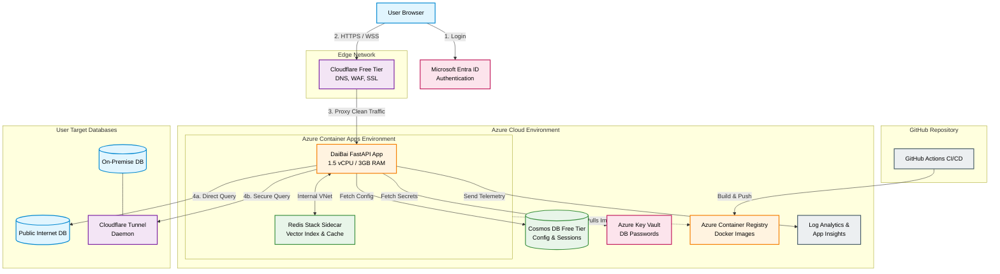

# Finalized Design Decisions Ledger (Complete)
1. **Compute / App Hosting:** Azure Container Apps (Serverless) using a KEDA cron scaler for scheduled warm-ups.

2. **User Config & Secrets:** Azure Cosmos DB (structural configuration) + Azure Key Vault (sensitive payloads).

3. **Vector Search & Caching:** Redis Stack hosted as a sidecar/secondary Azure Container App, with its KEDA cron warmup synced to the main app.

4. **Edge Networking & Ingress:** Cloudflare (Free Tier) terminating SSL, applying WAF rules, and proxying clean traffic to the Container App.

5. **Secure Egress (Target DBs):** Hybrid Approach — Native Azure dynamic IPs for Internet-hosted databases, and Cloudflare Tunnels (Zero Trust) for private/on-premise databases.

6. **CI/CD & Registry:** Azure Container Registry (ACR) Basic + GitHub Actions via Managed Identities/OIDC.

7. **Observability & Logging:** Azure Log Analytics + Application Insights (staying within the 5GB/mo free tier).

# 🏗️ DaiBai Azure Architecture: Final Specification
With all decisions locked in, we have designed a highly resilient, deeply secure, and incredibly cost-effective SaaS architecture. It perfectly balances the need to support up to 500 enterprise users with your strict "Scrooge-tier" budget requirements.

Here is the comprehensive architectural blueprint for the Azure end-state.

## 1. Unified Architecture Diagram

## 2. Component Blueprint & Responsibilities
* **Cloudflare (The Shield):** Intercepts all traffic to DaiBaiChat.com. Drops malicious bots and DDoS attacks, ensuring the Azure Container App never auto-scales due to garbage traffic.

* **Azure Container Apps (The Engine):** Runs the Python FastAPI server. It relies on a KEDA cron scaler to warm up before standard business hours, preventing users from suffering cold starts, while scaling down to practically zero at night to save costs.

* **Redis Stack Container (The Brain's Index):** A secondary container providing the RediSearch module. It acts as the semantic cache and vector index, while also providing the crucial mutation_lock for God-Emperor mode concurrency.

* **Azure Cosmos DB (The State):** The NoSQL store holding user configurations, available databases, chosen LLMs, and chat histories.

* **Azure Key Vault (The Vault):** Holds the actual database passwords. DaiBai uses Azure Managed Identities to fetch these silently at runtime, ensuring passwords never touch the code or Cosmos DB.

* **Azure Log Analytics (The Black Box):** Automatically ingests all Python console outputs and tracks LLM execution times, sending alerts if the system experiences critical failures.

* **GitHub Actions + ACR (The Assembly Line):** Automates the deployment. When code is pushed to main, GitHub securely authenticates to Azure, builds the Docker image, pushes it to the Basic registry, and triggers the Container App to reboot.

# 🚀 Moving to the "Setup" Phase
With the architecture mapped and finalized, the next logical step is to begin provisioning the infrastructure. To do this efficiently and reproducibly, we should use Infrastructure as Code (IaC).

We can write a single script (using Azure Bicep or Azure CLI) that will automatically spin up the Cosmos DB, Key Vault, Log Analytics, and the Container Apps Environment with all the correct permissions (Managed Identities) wired up perfectly.

Shall we start by generating the Azure CLI / Bicep deployment scripts to build the foundation, or would you prefer to start by adapting the Python FastAPI code to use Azure Managed Identities for Key Vault and Cosmos DB?