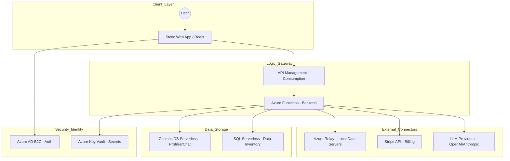
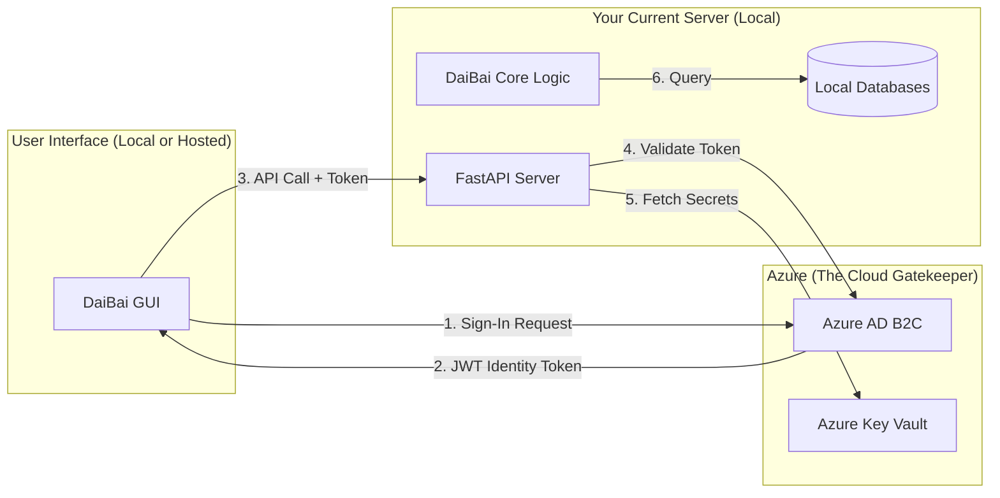
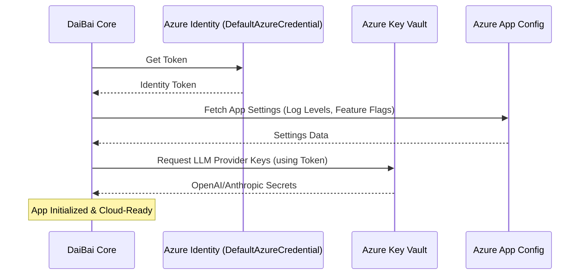
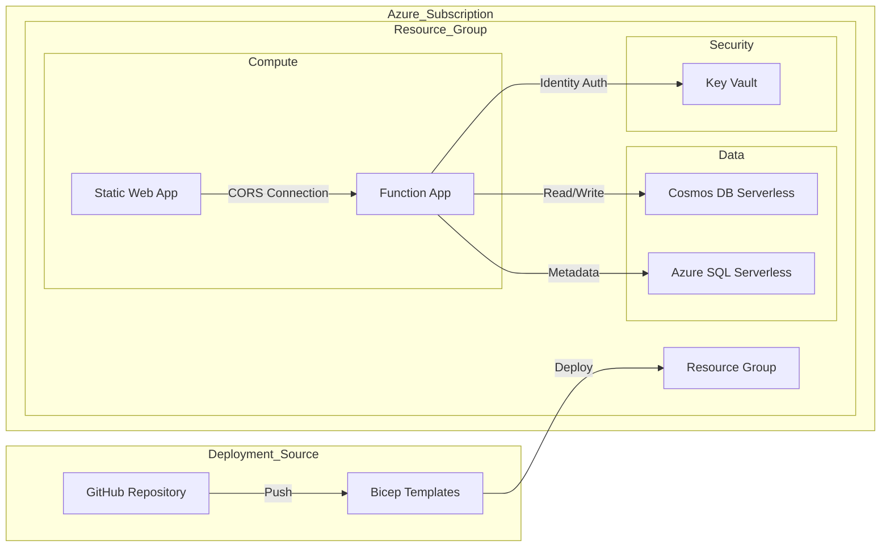
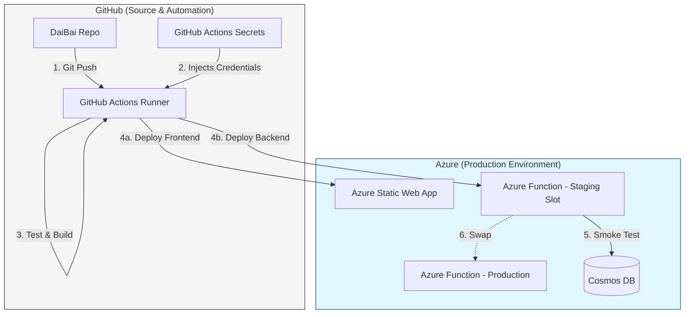
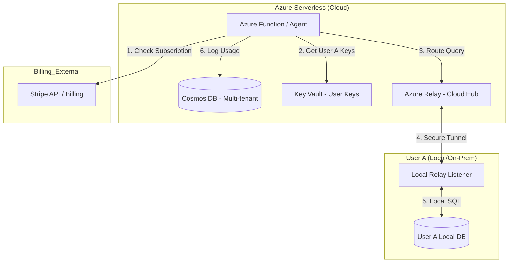

# DaiBai Azure Serverless Hosting Strategy

This document outlines the architecture, costing, and roadmap for deploying DaiBai on Azure using a "super-cheap" serverless model designed to scale from 1 to 10,000+ users.

## 1. Comprehensive Architecture

The architecture utilizes a consumption-based model where you only pay for active execution and data storage.

### Architecture Diagram



*[Mermaid source: [docs/mermaid/azure2-architecture.mmd](mermaid/azure2-architecture.mmd)]*

### Component Breakdown

| Component | Description |
|-----------|-------------|
| **Azure Static Web Apps** | Hosts the frontend with a free tier for hobbyists and a global CDN. |
| **Azure Functions (Python)** | Replaces the FastAPI server.py with serverless logic that scales to zero when idle. |
| **Azure AD B2C** | Provides secure user management (Free for first 50k monthly active users). |
| **Azure Key Vault** | Centralized storage for user-provided LLM keys and system database credentials. |
| **Azure Cosmos DB (Serverless)** | Stores chat history and agent metadata with pay-per-request pricing. |
| **Azure Relay/Hybrid Connections** | Enables the serverless cloud backend to securely query "local" data servers behind firewalls without VPNs. |

## 2. Costing Analysis (Monthly Estimates)

Estimates are based on typical consumption patterns for a serverless environment.

| Users | Compute (Functions) | Data (Cosmos/SQL) | Security (B2C/Vault) | Total Est./Mo |
|-------|----------------------|-------------------|----------------------|---------------|
| 1 | $0.00 (Free Grant) | $0.05 | $0.00 | **~$0.05 - $1.00** |
| 10 | $0.00 (Free Grant) | $0.50 | $0.00 | **~$5.00** |
| 100 | $5.00 | $15.00 | $1.00 | **~$21.00** |
| 1,000 | $45.00 | $120.00 | $10.00 | **~$175.00** |
| 10,000 | $400.00 | $900.00+ | $50.00 | **~$1,350.00+** |

## 3. Automated Migration Roadmap

| Phase | Description |
|-------|-------------|
| **Phase 1: Environment Abstraction** | Modify config.py to support DefaultAzureCredential for seamless local-to-cloud transition. Transition local .env variables to Azure App Configuration. |
| **Phase 2: Infrastructure as Code (IaC)** | Develop Bicep templates to automate the provisioning of the entire resource stack. |
| **Phase 3: CI/CD Pipeline** | Establish GitHub Actions to automate deployments directly to Azure Static Web Apps and Azure Functions. |
| **Phase 4: Billing & Metering** | Implement usage tracking within the Python logic to report "tokens used" or "tasks completed" to the Stripe Gateway. |

### Pre-Phase 1: Identity-First Hybrid Strategy

A recommended "Hybrid" approach: secure your application with enterprise-grade identity management immediately while keeping compute costs at zero by continuing to run the backend on your local machine or existing server.

#### The "Hybrid Identity" Architecture

In this phase, your application remains local, but the "Gatekeeper" (Authentication) is moved to Azure.



*[Mermaid source: [docs/mermaid/azure2-hybrid-identity.mmd](mermaid/azure2-hybrid-identity.mmd)]*

#### Implementation Steps

**Step A: Setup Azure AD B2C**

- **Tenant Creation:** Create a free Azure AD B2C tenant.
- **User Flows:** Define "Sign-up and Sign-in" flows. This provides the login screens without writing any HTML/CSS.
- **App Registration:** Register your DaiBai GUI as a "Single Page Application" and your FastAPI server as a "Web API."

**Step B: Refactor `daibai/api/server.py`**

Currently, `server.py` does not have formal authentication middleware. Add a security dependency:

- **FastAPI Security:** Use `fastapi.security.OAuth2AuthorizationCodeBearer`.
- **Token Validation:** Add a function to verify the JWT (JSON Web Token) sent by the user against your Azure B2C keys. If the token is missing or invalid, the API returns a 401 Unauthorized error.

**Step C: Update `daibai/core/config.py` for "Developer Identity"**

To access Azure services (like Key Vault) from your local machine:

- **Install Azure Identity:** Add `azure-identity` and `azure-keyvault-secrets` to your dependencies.
- **Use DefaultAzureCredential:** Update your config loader to attempt to use `DefaultAzureCredential()`.
- **Local Login:** Run `az login` on your local terminal. When your local `config.py` runs, it will use your identity to securely pull LLM keys from Azure Key Vault instead of reading them from a plain-text `.env` file.

#### Benefits of this Phased Approach

| Benefit | Description |
|---------|-------------|
| **Zero Infrastructure Cost** | The API and Agent still run on your hardware; no Azure Functions or App Service costs yet. |
| **Security Jumpstart** | LLM keys and database credentials are removed from local files and moved into Key Vault immediately. |
| **User Management** | Create user accounts and track usage because every request has a unique User ID. |
| **Seamless Final Migration** | Once working, full Azure migration is moving your code into an Azure Function; security and config logic stay the same. |

#### Prerequisites

- **Azure Subscription:** Pay-As-You-Go subscription (B2C has a free tier of 50,000 users).
- **Secret Audit:** Review `daibai.yaml.example` and `.env.example`—these are the values to move into Azure Key Vault first.

#### Azure Environment Reference

**Microsoft Entra Directory**

| Property | Value |
|----------|-------|
| **Directory Name** | DaiBai Customers |
| **Domain** | daibaiauth.onmicrosoft.com |
| **Directory (Tenant) ID** | `e12adb01-a6b3-47bb-86c0-d662dacb3675` |

**Application Registration: DaiBai-GUI**

| Property | Value |
|----------|-------|
| **Display Name** | DaiBai-GUI |
| **Application (client) ID** | `5f5462c3-47b1-4af0-9ee0-6271d9893780` |
| **Object ID** | `a8857d43-d6d1-48b2-a02b-30a0e32a8198` |
| **Directory (tenant) ID** | `e12adb01-a6b3-47bb-86c0-d662dacb3675` |
| **Supported account types** | My organization only |
| **Redirect URIs** | 1 SPA (configure as needed) |
| **State** | Activated |

**Application Registration: DaiBai-API**

| Property | Value |
|----------|-------|
| **Display Name** | DaiBai-API |
| **Application (client) ID** | `0d959490-bf5b-49f4-b7d2-97e4d3ff8c0d` |
| **Object ID** | `881fd2dd-ea73-4120-a618-1da921149c91` |
| **Directory (tenant) ID** | `e12adb01-a6b3-47bb-86c0-d662dacb3675` |
| **Supported account types** | My organization only |
| **Redirect URIs** | Add as needed |
| **State** | Activated |

*Note: Add a certificate or secret for client credentials, and configure the Application ID URI as needed for your API.*

*Use Microsoft Authentication Library (MSAL) and Microsoft Graph. ADAL and Azure AD Graph are deprecated. See [Microsoft Entra External ID](https://learn.microsoft.com/en-us/entra/external-id/) documentation.*

#### Enabling User Registration in Entra External ID

If the sign-in page does **not** show a "No account? Create one" link, registration is not enabled. Follow these steps in the Azure Portal:

**1. Create a Sign-up and Sign-in User Flow**

1. Sign in to [Microsoft Entra admin center](https://entra.microsoft.com/).
2. Switch to your **external tenant** (DaiBai Customers) via the directory switcher.
3. Go to **Entra ID** → **External Identities** → **User flows**.
4. Click **New user flow**.
5. Enter a name (e.g. `SignUpSignIn`).
6. Under **Identity providers**, select **Email Accounts** and choose:
   - **Email with password** – users sign up with email + password, or
   - **Email one-time passcode** – users sign up with email + OTP sent to their inbox.
7. Under **User attributes**, select what to collect (e.g. Display Name, Given Name).
8. Click **Create**.

**2. Add DaiBai-GUI to the User Flow**

1. In **User flows**, select the flow you created.
2. Under **Use**, click **Applications**.
3. Click **Add application**.
4. Select **DaiBai-GUI** from the list.
5. Click **Select**.

**3. Verify Redirect URI**

Ensure `http://localhost:8080/` (and your production URL) is listed under **Authentication** → **Redirect URIs** for DaiBai-GUI as a **Single-page application** platform.

**4. Test**

After setup, the sign-in page should show **"No account? Create one"**. New users click it to register. If it still doesn’t appear:

- Try an incognito/private window.
- Clear browser cache and cookies.
- Confirm the app is added to the user flow and the flow uses Email Accounts.

#### Microsoft Entra Identity: Login, Sign-Up & Credentials

DaiBai uses **Microsoft Entra External ID** (formerly Azure AD B2C for customers) to manage user identity. Entra provides login, self-service sign-up, and secure credential handling without storing passwords in the application.

**Identity Model**

| Aspect | Implementation |
|--------|----------------|
| **Provider** | Microsoft Entra External ID (CIAM) |
| **Tenant** | DaiBai Customers (`daibaiauth.onmicrosoft.com`) |
| **Library** | MSAL.js Browser SDK 2.35.0 |
| **Token Storage** | `sessionStorage` (cleared when tab closes) |

**Login Flow**

1. User clicks **Login** in the nav bar.
2. `signIn()` calls `msalInstance.loginPopup()` with scopes `['openid', 'profile']`.
3. A popup opens to `https://daibaiauth.ciamlogin.com` where the user enters email and password.
4. Entra validates credentials and returns an ID token and account object.
5. MSAL caches the session in `sessionStorage`.
6. The UI switches to show **Sign Out** and hides Login/Register.

**Sign-Up (Registration) Flow**

1. User clicks **Register** in the nav bar.
2. A hint appears: "Click 'No account? Create one' to register."
3. User is redirected to the sign-in page.
4. User clicks **"No account? Create one"** on the sign-in page (this link appears only when a Sign-up and sign-in user flow is configured and the app is added to it—see *Enabling User Registration* above).
5. User completes registration (email verification, password creation, etc.).
6. After successful registration, the user is logged in and redirected back.
7. New users appear in **Entra ID** → **Users** in the admin center.

*Note: Entra External ID does not support forcing the sign-up screen via MSAL. The flow always starts with sign-in; users must click "No account? Create one" to register.*

**Credentials & Token Management**

- **No passwords in app:** Passwords are never stored or handled by DaiBai. Entra manages authentication.
- **ID tokens:** MSAL receives JWT ID tokens proving the user's identity. These are cached in `sessionStorage`.
- **Access tokens:** For API calls (e.g. Microsoft Graph), `getTokenPopup()` acquires access tokens:
  - Tries `acquireTokenSilent()` first (no popup).
  - Falls back to `acquireTokenPopup()` if interaction is required (e.g. consent, re-auth).
- **Logout:** `signOut()` calls `logoutPopup()`, which clears the Entra session and MSAL cache.

**Configuration (app.js)**

```javascript
// Authority must include tenant ID for Entra External ID
authority: 'https://daibaiauth.ciamlogin.com/e12adb01-a6b3-47bb-86c0-d662dacb3675/'

// Required: ciamlogin.com is not trusted by default
knownAuthorities: ['https://daibaiauth.ciamlogin.com']
```

**UI Components**

| Button | Location | Action |
|--------|----------|--------|
| Login | Nav bar (right) | Opens login popup |
| Register | Nav bar (right) | Opens sign-up/sign-in flow (registration for new users) |
| Sign Out | Nav bar (right) | Logs out and clears session |

### Implementation Completed: Backend API Authentication & Key Vault

The following work has been implemented and is ready for use.

#### 1. Backend API Authentication (JWT Token Validation)

**What was done:**

- **Dependencies:** Added `PyJWT[crypto]` (gui extras) and `httpx` (dev extras) for token validation and testing.
- **Security scheme:** `OAuth2AuthorizationCodeBearer` with Entra ID URLs:
  - `authorizationUrl`: `https://daibaiauth.ciamlogin.com/{tenant}/oauth2/v2.0/authorize`
  - `tokenUrl`: `https://daibaiauth.ciamlogin.com/{tenant}/oauth2/v2.0/token`
- **Token validation:** `get_current_user()` dependency validates JWTs using JWKS from `https://daibaiauth.ciamlogin.com/{tenant}/discovery/v2.0/keys`. Validates signature, expiry, audience (`ENTRA_CLIENT_ID`), and issuer (`ENTRA_ISSUER`).
- **Protected endpoints:** All core API routes require authentication:
  - `GET/POST /api/settings`, `PUT /api/config`, `POST /api/test-llm`, `POST /api/config/fetch-models`
  - `GET/POST/DELETE /api/conversations`, `GET /api/conversations/{id}`
  - `POST /api/query`, `POST /api/execute`, `POST /api/upload`
  - `GET /api/schema`, `GET /api/tables`
- **WebSocket:** `/ws/chat` requires a `token` query parameter; connection is rejected with code 4001 if missing or invalid.
- **Frontend integration:** `apiFetch()` helper acquires an access token via `getTokenPopup({ scopes: ['openid', 'profile'] })` and adds `Authorization: Bearer <token>` to all API requests. WebSocket connects with `?token=...` in the URL.

**Files modified:**

- `daibai/api/server.py` – OAuth2 scheme, `get_current_user`, `_decode_and_validate_token`, route protection
- `daibai/gui/static/app.js` – `getApiToken()`, `apiFetch()`, WebSocket token in query
- `pyproject.toml` – `PyJWT[crypto]`, `httpx`
- `tests/test_auth.py` – 401 without auth, 200 with mocked valid token

#### 2. Azure Key Vault Integration

**What was done:**

- **Dependencies:** Added `azure-identity` and `azure-keyvault-secrets` to main project dependencies.
- **Config loader:** `load_config()` in `daibai/core/config.py` checks for `KEY_VAULT_URL`. If set:
  - Uses `DefaultAzureCredential()` and `SecretClient` to fetch secrets.
  - Maps Key Vault secret names to LLM provider configs: `OPENAI-API-KEY`, `GEMINI-API-KEY`, `ANTHROPIC-API-KEY`, `AZURE-OPENAI-API-KEY`, `DEEPSEEK-API-KEY`, `MISTRAL-API-KEY`, `GROQ-API-KEY`, `NVIDIA-API-KEY`, `ALIBABA-API-KEY`, `META-API-KEY`.
  - Injects secrets into `os.environ` for `${VAR}` resolution (e.g. `OPENAI_API_KEY` from `OPENAI-API-KEY`).
  - Fills provider `api_key` when YAML has empty or missing keys.
- **Fallback:** If `KEY_VAULT_URL` is unset or Key Vault access fails, config falls back to `.env` and YAML.

**Files modified:**

- `daibai/core/config.py` – `_fetch_secrets_from_keyvault()`, `_KEYVAULT_LLM_MAPPING`, Key Vault logic in `load_config()`
- `pyproject.toml` – `azure-identity`, `azure-keyvault-secrets`
- `tests/test_azure_config.py` – Key Vault fetch test, local fallback test

---

## What to Do Right Now

Follow these steps to run and verify the current implementation.

### 1. Install Dependencies

```bash
cd /path/to/daibai
python3 -m venv .venv
source .venv/bin/activate   # Windows: .venv\Scripts\activate
pip install -e ".[gui,dev]"
```

### 2. Run the Application (Local)

```bash
daibai-server
# or: python -m daibai.api.server
```

Open http://localhost:8080 in your browser.

### 3. Test API Security

- **Without login:** The auth gate blocks the app. API calls return 401.
- **With login:** Click Login, sign in with Entra, then use the app. API calls succeed with the Bearer token.

To test via curl:
```bash
curl -s -o /dev/null -w "%{http_code}\n" http://localhost:8080/api/settings
# Expect: 401
```

### 4. (Optional) Use Azure Key Vault for Secrets

If you want to pull LLM keys from Key Vault instead of `.env`:

1. **Log in to Azure:**
   ```bash
   az login
   ```

2. **Set the Key Vault URL:**
   ```bash
   export KEY_VAULT_URL="https://your-vault-name.vault.azure.net/"
   ```

3. **Create secrets** in your Key Vault (e.g. `OPENAI-API-KEY`, `GEMINI-API-KEY`) and grant your identity `Key Vault Secrets User` (or equivalent) access.

4. **Run the app** – config will load secrets from Key Vault when `KEY_VAULT_URL` is set.

### 5. Run Tests

```bash
pytest tests/test_auth.py tests/test_azure_config.py -v
```

### 5.1 DaiBai Test Suite Catalog

The following table summarizes the key tests in the DaiBai test suite. Use it as a quick reference when validating the plumbing (Cosmos DB, auth, config) and during the "Brain Transplant" migration.

**Test commands:**

| Command | Description |
|---------|-------------|
| `./scripts/cli.sh test` | Unit tests (excludes cloud; ~1s) |
| `./scripts/cli.sh test-cosmos` | Cosmos DB E2E (CosmosStore lifecycle; requires `COSMOS_ENDPOINT`) |
| `./scripts/cli.sh test-redis` | Redis add/retrieve/delete (requires `REDIS_URL`) |
| `./scripts/cli.sh test-db` | Golden Ticket (Cosmos Read/Write/Delete validation) |
| `python3 -m pytest tests/ -v -s` | Full suite (cloud tests skip when env not set) |

*Note: `test-cloud` was renamed to `test-cosmos` to reflect Cosmos DB specifically.*

| ID | Category | Test Name | Description | File | Target Component | Success | Failure |
| --- | --- | --- | --- | --- | --- | --- | --- |
| **01** | Cosmos | `test_cosmos_store_e2e_lifecycle` | Full Create/Read/Delete cycle via CosmosStore | `tests/test_cosmos_store.py` | CosmosStore + Real Azure | `PASSED` | `CredentialUnavailableError` |
| **02** | Cosmos | `test_cosmos_store_singleton_client` | Verify shared client (connection pool) | `tests/test_cosmos_store.py` | Connection Pool | `✓ [CLOUD-COSMOS]` | `AssertionError` (ID mismatch) |
| **03** | Cosmos | `test_cosmos_store_fastapi_lifespan_simulation` | Startup/Shutdown + graceful close | `tests/test_cosmos_store.py` | Async Clean-up | `✓ [CLOUD-COSMOS]` | `RuntimeError` |
| **04** | Data Logic | `test_get_history_returns_empty_on_cosmos_not_found` | Missing document returns `[]` | `tests/test_database_logic.py` | Graceful Fallback | `PASSED` | `KeyError` |
| **05** | Data Logic | `test_append_messages_fetches_extends_upserts` | Atomic fetch-extend-save | `tests/test_database_logic.py` | History Extension | `PASSED` | `TypeError` |
| **06** | API Flow | `test_post_query_creates_record_in_store` | Chat POST → record persisted | `tests/test_api.py` | FastAPI ↔ Store | `PASSED` | `500 Internal Error` |
| **07** | LLM Check | `test_gemini_get_models_live` | Live Gemini API (requires key) | `tests/test_gemini_get_models.py` | Gemini Auth | `Models returned: N` | `403 Forbidden` |
| **08** | Environment | `test_resolve_env_vars` | Env var injection from `.env` | `tests/test_config.py` | Config / `.env` | `PASSED` | `ValueError` |
| **09** | Lifespan | `test_server_lifespan_initializes_store_and_closes_gracefully` | FastAPI lifespan: store init, client active, graceful shutdown | `tests/test_server_lifespan.py` | FastAPI lifespan + CosmosStore | `✓ [CLOUD-LIFESPAN]` | `AssertionError` / skip if no COSMOS_ENDPOINT |
| **10** | Redis | `test_redis_add_and_retrieve_key` | Add key-value and retrieve it | `tests/test_redis.py` | Azure Cache for Redis | `✓ [CLOUD-REDIS]` | `ConnectionError` / skip if no REDIS_URL |
| **11** | Redis | `test_redis_delete_key` | Add key, delete it, verify gone | `tests/test_redis.py` | Redis delete | `✓ [CLOUD-REDIS]` | `ConnectionError` |
| **12** | Redis | `test_redis_retrieve_nonexistent_key` | Retrieve non-existent key returns None | `tests/test_redis.py` | Bad key retrieval | `✓ [CLOUD-REDIS]` | `AssertionError` |
| **13** | Redis | `test_redis_full_lifecycle` | Add, retrieve, delete, verify bad retrieval | `tests/test_redis.py` | Redis E2E | `✓ [CLOUD-REDIS]` | `ConnectionError` |
| **14** | Cache | `test_exact_match_retrieval` | Semantic cache: exact prompt returns cached response | `tests/test_semantic_cache.py` | SemanticCache | `✓ [CLOUD-CACHE]` | `AssertionError` |
| **15** | Cache | `test_semantic_similarity_retrieval` | Similar prompts (cosine > 0.95) return cached response | `tests/test_semantic_cache.py` | SemanticCache | `✓ [CLOUD-CACHE]` | `AssertionError` |
| **16** | Cache | `test_resilience_redis_down` | Redis down: graceful fallback to LLM | `tests/test_semantic_cache.py` | Resilience | `✓ [CLOUD-CACHE]` | `ConnectionError` |

**Dashboard tags:** Cloud tests use component-specific tags (`[CLOUD-COSMOS]`, `[CLOUD-REDIS]`, `[CLOUD-LIFESPAN]`, `[CLOUD-CACHE]`) so admins can see which service each test targets.

**Lifespan tests**

`tests/test_server_lifespan.py` verifies that the FastAPI app correctly manages the CosmosStore connection during startup and shutdown:

- **Startup:** `app.state.store` is initialized and is an instance of `CosmosStore`.
- **Client creation:** After a request (e.g. `/health`), the CosmosClient within the store is active (`store._client` is not `None`).
- **Shutdown:** When the `TestClient` context exits, the lifespan shutdown runs and the store's connection is closed (`store._client` is `None`).

The test uses `TestClient(app)` to trigger lifespan events and requires `COSMOS_ENDPOINT` to be set; otherwise it is skipped.

**Quick run commands:**

```bash
./scripts/cli.sh test          # Unit tests (excludes cloud)
./scripts/cli.sh test-cosmos    # CosmosStore E2E (requires COSMOS_ENDPOINT)
./scripts/cli.sh test-redis     # Redis add/retrieve/delete (requires REDIS_URL)
python3 -m pytest tests/ -v -s # Full suite (all tests; cloud/Redis skip when env not set)
```

**Integrated Test Dashboard**

At the end of each run, `conftest.py` prints a dashboard summarizing key tests by category. Cloud tests use component-specific tags so admins can see which Azure service each test targets:

| Tag | Color | Component |
|-----|-------|-----------|
| `[DB]` | Cyan | Database logic (mocked) |
| `[API]` | Green | API flow |
| `[CLOUD-COSMOS]` | Yellow | Cosmos DB |
| `[CLOUD-REDIS]` | Yellow | Azure Cache for Redis |
| `[CLOUD-LIFESPAN]` | Yellow | FastAPI lifespan |
| `[CLOUD-CACHE]` | Yellow | Semantic cache (Redis + embeddings) |

**Example output:**

```
──────────────────────────────────────────────────────────────────────
  Test Dashboard
──────────────────────────────────────────────────────────────────────
  PASS [API] When a user sends a chat message, the server saves both...
  PASS [DB] When a conversation document exists in Cosmos, fetching...
  PASS [DB] When a conversation does not exist yet, fetching it ret...
  PASS [DB] When a document exists but has no messages key, we safe...
  PASS [DB] Saving a conversation writes the session id and message...
  PASS [DB] Appending new messages loads the existing conversation,...
  PASS [DB] Listing conversations converts raw Cosmos documents int...
  PASS [DB] Deleting a conversation that does not exist does not ra...
  PASS [CLOUD-CACHE] Save a response for "What is Azure?" and retrieve...
  PASS [CLOUD-CACHE] Store for "How do I deploy to Azure?", query with...
  SKIP [CLOUD-COSMOS] test_cosmos_store_singleton_client
  SKIP [CLOUD-LIFESPAN] test_server_lifespan_initializes_store_and_clos...
  SKIP [CLOUD-REDIS] Add a key-value pair and retrieve it successfully.
  ...
──────────────────────────────────────────────────────────────────────
================= 61 passed, 2 skipped, 10 deselected in 2.00s ==================
```

### 6. (Optional) Azure Cache for Redis Setup

To provision Azure Cache for Redis (Basic C0 tier) and add `REDIS_URL` to your `.env`:

```bash
az login
./scripts/cli.sh redis-create
```

Or run the script directly (each step blocks until complete):

```bash
# 0. Register Microsoft.Cache provider (if not already)
az provider register --namespace Microsoft.Cache --wait

# 1. Create Resource Group (if not already created)
az group create --name daibai-rg --location eastus

# 2. Create Azure Cache for Redis (Basic C0 - blocks ~10-15 min)
az redis create --location eastus --name daibai-redis --resource-group daibai-rg --sku Basic --vm-size c0

# 3. Retrieve the primary connection string
az redis list-keys --name daibai-redis --resource-group daibai-rg --query primaryConnectionString -o tsv
```

The `redis-create` command automatically writes `REDIS_URL` to `.env` (creates the file from `.env.example` if needed, or updates an existing `REDIS_URL` line).

**Semantic cache (always on):** When `REDIS_URL` is set, the agent automatically wraps all LLM providers with `SemanticCache`. Cache is used by default; disable only for testing or debugging:

```bash
export DAIBAI_DISABLE_SEMANTIC_CACHE=1   # Bypass cache (error isolation, testing)
```

Then run the Redis integration tests:

```bash
./scripts/cli.sh test-redis
```

**Override via env:** `REDIS_RESOURCE_GROUP`, `REDIS_NAME`, `REDIS_LOCATION`. The script registers the Microsoft.Cache provider if needed and blocks until the full Redis deployment completes (~15 min).

### 7. (Optional) Validate Cosmos DB Access

If you have Cosmos DB configured (role assignment + `COSMOS_ENDPOINT`), run the Golden Ticket check:

```bash
./scripts/cli.sh test-db
```

Success shows green `✓ GOLDEN TICKET VALID`; failure shows red `✗ FAILED` with the error. See *Cosmos DB Data Access Setup* below for full setup.

---

## Cosmos DB Data Access Setup (The "Second Lock")

Cosmos DB uses a **data-plane** role model that is separate from Azure management-plane RBAC. The **Cosmos DB Built-in Data Contributor** role does not appear in the standard Azure Portal "Roles" list—you must grant it via the Azure CLI.

### Why This Step Is Required

- **Management-plane vs. data-plane:** The Portal "Roles" tab shows management roles (create databases, scale throughput). Data-plane roles (read/write documents) are assigned via `az cosmosdb sql role assignment`.
- **Role definition ID:** `00000000-0000-0000-0000-000000000002` is the fixed, universal ID for **Cosmos DB Built-in Data Contributor** across all Azure tenants.

### Step 1: Get Your Principal ID

```bash
az ad signed-in-user show --query id -o tsv
```

Example output: `5fdfa982-4781-460e-a4b9-62c45f55aab9`

Ensure you are logged in: `az login`.

### Step 2: Create the Role Assignment

Run this command (replace the principal ID with yours if different):

```bash
az cosmosdb sql role assignment create \
    --account-name daibai-metadata \
    --resource-group daibai-rg \
    --scope "/" \
    --principal-id 5fdfa982-4781-460e-a4b9-62c45f55aab9 \
    --role-definition-id 00000000-0000-0000-0000-000000000002
```

**Parameters:**

| Parameter | Value | Description |
|-----------|-------|-------------|
| `--account-name` | `daibai-metadata` | Cosmos DB account name |
| `--resource-group` | `daibai-rg` | Resource group |
| `--scope` | `"/"` | Grants permission across the entire account (all databases and containers) |
| `--principal-id` | Your object ID | Your Azure AD/Entra user ID |
| `--role-definition-id` | `00000000-0000-0000-0000-000000000002` | Cosmos DB Built-in Data Contributor |

### Step 3: Set the Cosmos Endpoint

Add to your `.bashrc` (or equivalent):

```bash
export COSMOS_ENDPOINT="https://daibai-metadata.documents.azure.com:443/"
```

Reload your shell: `source ~/.bashrc` (or run your `rebash` command).

### Step 4: Verify Access

Role assignments can take up to **60 seconds** to propagate. To verify:

```bash
az cosmosdb sql role assignment list --account-name daibai-metadata --resource-group daibai-rg
```

If you see a JSON block containing your principal ID (`5fdfa982...`), you have data-plane access.

### CLI Shortcut

You can also use the DaiBai CLI to create the role assignment (auto-fetches your principal ID):

```bash
./scripts/cli.sh cosmos-role
```

Or with a specific principal ID:

```bash
./scripts/cli.sh cosmos-role --principal-id 5fdfa982-4781-460e-a4b9-62c45f55aab9
```

Override account or resource group via environment variables:

```bash
COSMOS_ACCOUNT_NAME=daibai-metadata COSMOS_RESOURCE_GROUP=daibai-rg ./scripts/cli.sh cosmos-role
```

### Step 5: Validate Access (Golden Ticket)

Run the Cosmos DB validation script to confirm Read/Write/Delete works:

```bash
./scripts/cli.sh test-db
```

**Prerequisites:** A project virtual environment with dependencies installed. If you don't have one:

```bash
python3 -m venv .venv
source .venv/bin/activate
pip install -e .
```

**What the script does:** `test_cosmos.py` performs a full Create → Read → Delete cycle on the `conversations` container:

1. **Create:** Upserts a test document `{"id": "test-session", "message": "Hello Azure"}`
2. **Read:** Retrieves the document and prints it
3. **Delete:** Removes the test document (leaves the database clean)

**Output:** Color-coded for quick scanning:

- **Success:** Green `✓ GOLDEN TICKET VALID` with a checklist of verified items
- **Failure:** Red `✗ FAILED` with the error message

**Example success output:**

```
Connecting to Cosmos DB...
Create: Upserting test document...
  ✓ OK
Read: Retrieving document...
  Document: {'id': 'test-session', 'message': 'Hello Azure', ...}
Delete: Removing test document...
  ✓ OK

✓ GOLDEN TICKET VALID
  Cosmos DB Read/Write/Delete validation passed.

  Verified:
  ✓ Authentication (az login via DefaultAzureCredential)
  ✓ Permission (Data Contributor role active)
  ✓ Plumbing (COSMOS_ENDPOINT set correctly)
```

**What the Golden Ticket validates:**

| Check | Meaning |
|-------|---------|
| **Authentication** | `DefaultAzureCredential` works (you are logged in via `az login`) |
| **Permission** | Your Data Contributor role assignment is active and propagated |
| **Plumbing** | `COSMOS_ENDPOINT` is correctly exported and readable by Python |

**Environment overrides:** `COSMOS_DATABASE` and `COSMOS_CONTAINER` default to `daibai-metadata` and `conversations`; override if your setup differs.

### Implementation Completed: Stateless Conversation Store

The backend has been refactored to persist chat history in Azure Cosmos DB.

**Files:**

- `daibai/api/database.py` – `CosmosConversationStore` class (async, uses `azure.cosmos.aio` and `DefaultAzureCredential`)
- `daibai/api/server.py` – All conversation endpoints use `CosmosStore` instead of in-memory dict

**Data model:**

- Document `id` = `session_id` (conversation ID)
- Partition key: `/id`
- `messages`: list of `{role, content, timestamp, sql?, results?}`

**Flow:**

1. On each request: load existing document for `session_id` from Cosmos DB (or start with an empty list)
2. After AI response: append user + assistant messages and upsert the document

**Requirements:** `COSMOS_ENDPOINT` must be set. Database: `daibai-metadata`, container: `conversations` (override via `COSMOS_DATABASE`, `COSMOS_CONTAINER`).

---

### Phase 1: Environment Abstraction & Cloud-Ready Refactoring

Phase 1 focuses on decoupling the DaiBai core logic from local file-based configurations and secrets, making the codebase "cloud-aware" without breaking local development.

#### Goal

*Transition from local `.env` and `daibai.yaml` files to a secure, centralized identity-based configuration system using **Azure App Configuration** and **Azure Key Vault**.*

#### Technical Tasks

**A. Managed Identity Integration**

- **Implement Managed Identity:** Update `daibai/core/config.py` to use `DefaultAzureCredential` from the `azure-identity` library. This allows the app to authenticate to Azure services without storing local service principal keys.
- **Conditional Loading:** Modify the configuration loader to check for an environment variable (e.g., `AZURE_DEPLOYMENT=true`). If false, it defaults to the existing `dotenv` and YAML loading logic to preserve local dev functionality.

**B. Secrets Externalization (Key Vault)**

- **LLM Key Migration:** Move all provider keys (OpenAI, Anthropic, Gemini, etc.) from the `.env` file into **Azure Key Vault**.
- **Code Refactor:** Update the `Config` class in `daibai/core/config.py` to fetch secrets dynamically from the Key Vault URI during runtime rather than reading from `os.getenv` at startup.

**C. Database Connection Abstraction**

- **Connection String Mapping:** Update `daibai/core/agent.py` to support dynamic connection string retrieval. Instead of reading static strings from a local file, the agent should query the **Azure SQL Serverless** (Data Inventory) for the metadata of the requested data server.
- **Azure Relay Integration (PoC):** Introduce the `azure-relay-bridge` for local database access. Refactor the database connection logic in the agent to route through a local relay listener if the target server is marked as "On-Premise".

**D. API Server Adaption**

- **FastAPI to Azure Functions:** Create a wrapper for `daibai/api/server.py` using `azure-functions-python-library`.
- **Stateless Transition:** Ensure all session-specific data currently stored in memory within `server.py` is moved to a distributed cache (Azure Cache for Redis) or the serverless Cosmos DB instance to support horizontal scaling.

#### Implementation Diagram



*[Mermaid source: [docs/mermaid/azure2-phase1.mmd](mermaid/azure2-phase1.mmd)]*

#### Success Criteria

- [ ] The application starts successfully on a local machine without an .env file (using Azure CLI logged-in credentials).
- [ ] `daibai/core/config.py` no longer contains hardcoded fallbacks for sensitive keys.
- [ ] The application can retrieve at least one "Remote" database connection string from Azure Key Vault and successfully run a query via `daibai/core/agent.py`.

#### Sources Used

- `daibai/core/config.py` (Local config logic)
- `daibai/core/agent.py` (Database orchestration logic)
- `daibai/api/server.py` (API/Backend structure)
- Previous Architecture Analysis (Azure service mapping)

### <u>Phase 2: Infrastructure as Code (IaC) & Automated Provisioning</u>

Phase 2 transitions the project from manual configuration to a "Single-Command Deployment" model. This phase ensures that the entire serverless stack—from security to data storage—is provisioned automatically and consistently.

#### Goal

*Automate the creation and configuration of the Azure environment using **Azure Bicep**, ensuring that all components (Functions, Cosmos DB, Key Vault) are linked with the correct permissions (Least Privilege) from the start.*

#### Technical Implementation Tasks

**A. Template Development (Bicep/Terraform)**

- **Modular Design:** Create reusable Bicep modules for each tier (Storage, Compute, Security) to maintain a clean codebase.
- **Serverless Resource Definition:**
  - **Compute:** Define an `Azure Function App` on a Consumption Plan (Y1) to minimize costs.
  - **Storage:** Define a `Cosmos DB` account explicitly set to **Serverless Mode** (Standard mode incurs hourly costs even without traffic).
  - **Front-End:** Define an `Azure Static Web App` for the React/HTML interface.

**B. Security & Identity Linkage**

- **Role-Based Access Control (RBAC):** Assign the `Key Vault Secrets User` role to the Function App's Managed Identity within the Bicep template.
- **Network Hardening:** Configure the Key Vault to allow access only from the Function App's outbound IP range or via Private Endpoints (if the budget allows for the slightly higher cost of Private Links).

**C. Database Initialization Scripting**

- **Schema Provisioning:** Create a post-deployment script (or use a GitHub Action) to initialize the Cosmos DB containers and Azure SQL (Serverless) tables required for user sessions and Stripe transaction logs.
- **Identity Mapping:** Seed the SQL database with the initial "System" roles required for the DaiBai Agent to begin managing user requests.

#### Infrastructure Flow Diagram



*[Mermaid source: [docs/mermaid/azure2-phase2.mmd](mermaid/azure2-phase2.mmd)]*

#### Implementation Checklist

| Task | Description | Status |
|------|-------------|--------|
| Bicep Setup | Initialize main.bicep and modularize resource groups. | [ ] |
| Serverless Locking | Verify Cosmos DB and SQL are locked to "Consumption/Serverless" tiers. | [ ] |
| Managed Identity | Implement system-assigned identity for the Function App. | [ ] |
| Key Vault Scoping | Map specific secrets (Stripe Keys, LLM Keys) to RBAC roles. | [ ] |
| SWA Integration | Link the Static Web App to the Function App API back-end. | [ ] |

#### Success Criteria

- [ ] The entire DaiBai environment can be deployed to a fresh Azure subscription by running `az deployment sub create`.
- [ ] No secrets are stored in the Bicep files (all referenced via Key Vault or parameters).
- [ ] Monthly "Idle Cost" of the provisioned infrastructure remains at $0.00.

### <u>Phase 3: CI/CD Automation & Production-Grade Delivery</u>

Phase 3 focuses on the "Automated Migration" of code from the repository to Azure. By the end of this phase, any change pushed to the GitHub repository will trigger an automated pipeline that tests, builds, and deploys the serverless components and the frontend.

#### Goal

*Establish a robust **GitHub Actions** pipeline that automates the lifecycle of the DaiBai platform, ensuring zero-downtime deployments and high code quality.*

#### Technical Implementation Tasks

**A. GitHub Actions Workflow Configuration**

- **Continuous Integration (CI):** Triggered on every Pull Request to `main`.
  - Runs `pytest` on existing tests (e.g., `tests/test_config.py`, `tests/test_llm_providers.py`).
  - Performs linting and security scanning (Bandit) on the Python core.
- **Continuous Deployment (CD):** Triggered on merges to `main`.
  - **Function App Deploy:** Uses `Azure/functions-action` to deploy the Python backend.
  - **Static Web App Deploy:** Uses the `Azure/static-web-apps-deploy` action to build the `index.html`, `app.js`, and `styles.css` from the `daibai/gui/static/` directory.

**B. Environment Synchronization**

- **Staging vs. Production:** Implement GitHub Environments. Secrets like `STRIPE_API_KEY` and `DATABASE_CONNECTION_STRING` are scoped to specific environments to prevent accidental production overrides during testing.
- **Automated Slot Swapping:** For the Function App, deploy to a "staging" slot first, run smoke tests, then swap to "production" to ensure zero downtime.

**C. Monitoring & Feedback Loops**

- **Azure Monitor / App Insights:** The pipeline automatically injects the `APPINSIGHTS_INSTRUMENTATIONKEY` into the Function App.
- **Alerting:** Configure GitHub to notify the team via Slack/Discord if a deployment fails or if the serverless consumption exceeds a pre-set "Cheap Tier" budget.

#### CI/CD Architecture Diagram



*[Mermaid source: [docs/mermaid/azure2-phase3.mmd](mermaid/azure2-phase3.mmd)]*

#### Implementation Checklist

| Task | Description | Status |
|------|-------------|--------|
| Workflow Setup | Create `.github/workflows/main_deploy.yml`. | [ ] |
| Azure Service Principal | Create a secret `AZURE_CREDENTIALS` for GitHub to talk to Azure. | [ ] |
| Static Web App Token | Link the deployment token for the `daibai/gui/static` folder. | [ ] |
| Function Build | Configure Python dependency installation (pip) in the runner. | [ ] |
| Environment Check | Set up "Production" environment protection in GitHub settings. | [ ] |

#### Success Criteria

- [ ] **Automated Flow:** Pushing a change to `daibai/api/server.py` results in a live API update within 5 minutes without manual intervention.
- [ ] **Validation:** All tests in the `tests/` directory must pass before any code reaches the Azure environment.
- [ ] **Security:** No developers require direct access to the Azure Portal for day-to-day updates.

### <u>Phase 4: Billing Integration, Multi-Tenancy & Hybrid Connectivity</u>

Phase 4 transforms the platform from a hosted tool into a commercial product. This phase focuses on monetization (Stripe), isolating user data (Multi-tenancy), and enabling the "Killer App" feature: querying local on-premise databases from a serverless cloud environment.

#### Goal

*Implement a secure, usage-based billing system and a "Hybrid Relay" that allows the serverless Azure Function to reach into a user's local network to perform data tasks without compromising security.*

#### Technical Implementation Tasks

**A. Stripe Integration (The Gateway)**

- **Metered Billing Logic:** Update `daibai/core/agent.py` to record "Task Units" or "Token Counts" upon completion of a query.
- **Webhook Handler:** Create a new Azure Function endpoint (`/api/webhooks/stripe`) to handle subscription events, payment failures, and credit refills.
- **Usage Reporting:** Implement a background "Sweeper" (Timer-triggered Function) that syncs usage data from Cosmos DB to Stripe every 24 hours.

**B. Logical Multi-Tenancy**

- **Partition Key Strategy:** Update Cosmos DB and SQL Serverless schemas to use `user_id` as the Partition Key. This ensures that a query from "User A" is physically and logically incapable of accessing "User B's" data.
- **Key Vault Scoping:** Implement a "User-Vault" pattern where the app retrieves `BYOK` (Bring Your Own Key) secrets from Key Vault using tags associated with the authenticated B2C user ID.

**C. The Hybrid Relay (Local Data Access)**

- **Azure Relay / Hybrid Connections:** To solve the "Super Cheap" requirement for local data access (avoiding expensive VPN Gateways), implement the Azure Relay bridge.
- **Local Listener:** Provide a small Python script (based on `daibai/cli/`) that the user runs locally. This script opens an outbound connection to the Azure Relay, allowing the Cloud Function to "tunnel" SQL queries down to the local server safely.

#### Product Flow & Multi-Tenancy Diagram



*[Mermaid source: [docs/mermaid/azure2-phase4.mmd](mermaid/azure2-phase4.mmd)]*

#### Implementation Checklist

| Task | Description | Status |
|------|-------------|--------|
| Stripe SDK | Integrate `stripe-python` into the backend logic. | [ ] |
| Usage Schema | Design the UsageLogs container in Cosmos DB with TTL (Time To Live). | [ ] |
| B2C Claims | Map `sub` (Subject ID) from B2C tokens to all database queries. | [ ] |
| Relay PoC | Establish a successful "Cloud-to-Local" query using Azure Relay. | [ ] |
| BYOK UI | Add a "Manage Keys" section to the Static Web App frontend. | [ ] |

#### Success Criteria

- [ ] **Monetization:** A user can sign up, enter a credit card, and see their usage reflected in a dashboard.
- [ ] **Privacy:** Database query logs for User A are strictly invisible to User B.
- [ ] **Hybrid Reach:** The system successfully queries a PostgreSQL/SQL Server instance running on a developer's local laptop via the Azure cloud interface.
- [ ] **Cost:** The Azure Relay usage stays within the "Standard" tier (approx. $10/mo), keeping the base cost extremely low.

## 4. Outstanding Items (Beyond Architecture)

- **Multi-Tenancy Logic:** Ensure the database schema and API endpoints isolate data so users cannot see each other's local server configurations.
- **BYOK (Bring Your Own Key) Support:** Implement a secure UI for users to store their own Anthropic/OpenAI keys in an encrypted per-user vault.
- **Stripe Webhook Integration:** Build handlers for subscription lifecycle events (payment success, cancellation, credit exhaustion).
- **Local Agent Binary:** Create a lightweight "Relay Agent" that users can install locally to bridge their local data servers to the Azure cloud.
- **Telemetry & Audit:** Implement Azure Monitor/Application Insights to track failed queries and agent performance across different LLM providers.
