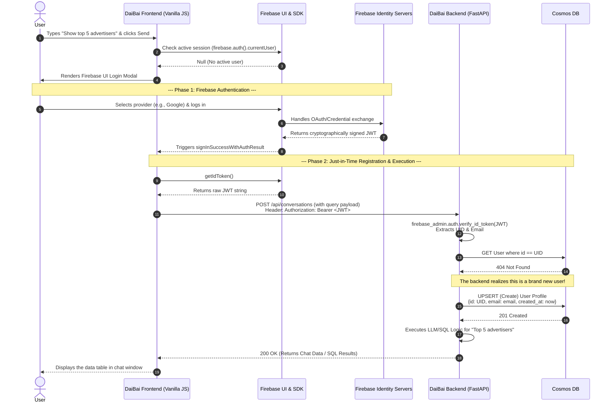
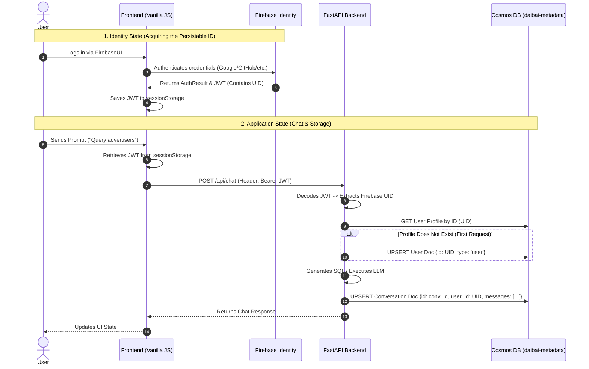

# Registration Flow

## Registration Flow Sequence




## Registration Flow Table


| Step    | Component Interaction           | Description of Action                                                                                                                                                                                               | Transfer Object / Payload                                                                              |
| ------- | ------------------------------- | ------------------------------------------------------------------------------------------------------------------------------------------------------------------------------------------------------------------- | ------------------------------------------------------------------------------------------------------ |
| **1**   | **User ➔ Frontend**             | The user attempts to send a chat message.                                                                                                                                                                           | `String`: "Show me the top 5 most active advertisers"                                                  |
| **2-3** | **Frontend ➔ Firebase SDK**     | The frontend intercepts the click. It asks the Firebase SDK if a user is logged in. Because the response is null, it blocks the chat request and pops open the FirebaseUI widget.                                   | *None (Local SDK check)*                                                                               |
| **4-5** | **User ➔ Firebase Servers**     | The user clicks a provider (like Google) and enters their credentials. Firebase handles the secure OAuth handshake completely independently of your Python backend.                                                 | `OAuth Credentials` (Handled by Google)                                                                |
| **6**   | **Firebase Servers ➔ Frontend** | Firebase confirms the identity and hands the frontend SDK a secure **JSON Web Token (JWT)**. This token contains the user's unique Firebase UID, email, and expiration time.                                        | `AuthResult Object` (contains the JWT and basic user profile)                                          |
| **7**   | **Frontend ➔ Backend**          | The frontend resumes the user's original action. It packages the chat question and attaches the Firebase JWT to the HTTP headers before sending it to FastAPI.                                                      | **Header:** `Authorization: Bearer eyJhbGci...` **Body:** `{"query": "Show me the top..."}`            |
| **8**   | **Backend (Internal)**          | FastAPI's `get_current_user` dependency intercepts the request. It uses the `firebase-admin` Python SDK to mathematically verify the JWT signature against Google's public keys. It extracts the `uid` and `email`. | **Extracted Data:** `{"uid": "abc123xyz", "email": "amram@example.com"}`                               |
| **9**   | **Backend ➔ Cosmos DB**         | FastAPI asks the database if it has a profile for `uid: abc123xyz`. The database returns a 404 Not Found because this user has never spoken to DaiBai before.                                                       | **Query:** `SELECT * FROM users WHERE id='abc123xyz'`                                                  |
| **10**  | **Backend ➔ Cosmos DB**         | **(The Registration Step):** FastAPI realizes this is a new user. It immediately inserts a new record into the database so the user has a "folder" to save their conversation history.                              | **JSON Payload:** `{"id": "abc123xyz", "email": "amram@example.com", "created_at": "2026-02-27T..."}`  |
| **11**  | **Backend (Internal)**          | With the user safely registered in the database, FastAPI proceeds to generate the SQL for "top 5 active advertisers", executes it, and gets the data.                                                               | *LLM & Database specific payloads*                                                                     |
| **12**  | **Backend ➔ Frontend**          | FastAPI returns the result of the chat to the frontend, alongside the new `conversation_id` mapped to the newly registered user.                                                                                    | **JSON Response:** `{"conversation_id": "conv_999", "answer": "Here are the top 5...", "data": [...]}` |


# State Data Storage Matrix

## State Data Storage Matrix Sequence




## State Storage Matrix Table


| Step                         | Data Store                                                         | What is Stored                                                                                                                     | When it Happens                                                                        | Why it is Stored Here                                                                                                                                                                                              |
| ---------------------------- | ------------------------------------------------------------------ | ---------------------------------------------------------------------------------------------------------------------------------- | -------------------------------------------------------------------------------------- | ------------------------------------------------------------------------------------------------------------------------------------------------------------------------------------------------------------------ |
| **1. Identity Creation**     | **Firebase Servers**                                               | Encrypted passwords, OAuth links (Google/GitHub), verified emails, and the master Firebase `UID`.                                  | The moment the user successfully completes the FirebaseUI login popup on the frontend. | Firebase absorbs the security liability. Your infrastructure never touches raw passwords or manages OAuth handshakes.                                                                                              |
| **2. Session Persistence**   | **Browser Storage** (`sessionStorage` or `localStorage`)           | The temporary **JSON Web Token (JWT)** issued by Firebase.                                                                         | Immediately after Firebase returns a success callback to your Vanilla JS frontend.     | The Vanilla JS frontend is stateless. It needs to hold onto this token so it can attach it to the `Authorization` header of every subsequent API call to your backend.                                             |
| **3. User Registration**     | **Azure Cosmos DB** (`daibai-metadata`)                            | A User Profile Document: `{"id": "firebase_uid", "type": "user", "email": "...", "preferences": {}}`                               | Automatically intercepted by FastAPI on the user's *very first* secure API request.    | To establish a permanent anchor in your application database. You need a record with the partition key (`/id`) matching the Firebase UID to tie all future chats to this specific person.                          |
| **4. Chat History Creation** | **Azure Cosmos DB** (`daibai-metadata`, `conversations` container) | A new Conversation Document: `{"id": "conv_123", "user_id": "firebase_uid", "messages": [{"role": "user", "content": "..."}]}`     | When the user starts a brand new chat thread and sends their first prompt.             | To persist the application state. When the user logs in from a different computer later, the backend fetches all documents where `user_id` matches their UID to populate the sidebar.                              |
| **5. Chat History Updating** | **Azure Cosmos DB** (`daibai-metadata`, `conversations` container) | The *updated* Conversation Document (appending the AI's generated SQL and the user's follow-up questions to the `messages` array). | Every time a back-and-forth exchange completes in an active chat window.               | Document databases handle complete overwrites well. You grab the existing array of messages, append the newest interactions, and UPSERT the entire document back to Cosmos DB to maintain the continuous chat log. |


```python
import firebase_admin
from firebase_admin import credentials

cred = credentials.Certificate("firebase-adminsdk.json")
firebase_admin.initialize_app(cred)
```

# Auto Registration Point


| Step                | Action                                                                               | Responsibility             |
| ------------------- | ------------------------------------------------------------------------------------ | -------------------------- |
| **1. Validation**   | User enters email; clicks verification link or logs in via Google.                   | **Firebase (Client-Side)** |
| **2. Issuance**     | Firebase issues a cryptographically signed JWT to the browser.                       | **Firebase (Cloud)**       |
| **3. Verification** | FastAPI uses the Service Account JSON to verify the JWT signature.                   | **FastAPI (auth.py)**      |
| **4. Registration** | If verified, the backend calls `ensure_user_exists` to create the Cosmos DB profile. | **FastAPI (database.py)**  |


# Account Management Matrix

Since you want to finalize account management now, here is exactly how to handle each requirement using the most efficient 2026 methods:


| Requirement          | Recommended Mechanism                            | UX Approach                                                                                   |
| -------------------- | ------------------------------------------------ | --------------------------------------------------------------------------------------------- |
| **Change Name**      | `updateProfile(user, {displayName: "New Name"})` | Custom Modal in your Navigation Bar.                                                          |
| **Change Phone**     | `updatePhoneNumber(user, phoneCredential)`       | Custom Modal + Firebase SMS Verification.                                                     |
| **Change Password**  | `sendPasswordResetEmail(auth, email)`            | **Best Way:** Sends an email link. Offloads the "New Password" UI to Google's secure servers. |
| **Pause/Cancel Sub** | **Stripe Customer Portal**                       | **Best Way:** Redirect the user to a Stripe-hosted page. Do not build this UI yourself.       |
| **Close Account**    | `user.delete()`                                  | Trigger a "Are you sure?" modal, then call delete. (Requires recent login!)                   |


# Custom domain for email templates

## Verify domain

To verify your domain, add the following DNS records in your domain registrar.


| Domain name                         | Type  | Value                                                  |
| ----------------------------------- | ----- | ------------------------------------------------------ |
| daibaichat.com                      | TXT   | v=spf1 include:_spf.firebasemail.com ~all              |
| daibaichat.com                      | TXT   | firebase=daibai-affb0                                  |
| firebase1._domainkey.daibaichat.com | CNAME | mail-daibaichat-com.dkim1._domainkey.firebasemail.com. |
| firebase2._domainkey.daibaichat.com | CNAME | mail-daibaichat-com.dkim2._domainkey.firebasemail.com. |


note:
It can take up to 48 hours to verify your domain. Check back later to finish adding your custom domain.

---

## Troubleshooting: "Create account" shows instead of "Sign in" for existing users

**Symptom:** When entering an existing user's email in the Sign In modal, FirebaseUI shows the "Create account" form (name + password) instead of the "Sign in" form (password only).

**Cause:** Firebase's **email enumeration protection** (enabled by default for projects created after Sept 2023) prevents FirebaseUI from checking whether an email exists. Without that check, it defaults to the create-account flow.

**Fix:** Disable email enumeration protection for your Firebase project.

### Option 1: Firebase Console (easiest)

1. Go to [Firebase Console → Authentication → Settings](https://console.firebase.google.com/project/_/authentication/settings)
2. In **User account management** → **User actions**
3. **Uncheck** "Email enumeration protection (recommended)"
4. Click **Save**

### Option 2: CLI (gcloud + curl)

```bash
./scripts/cli.sh firebase-disable-email-enum
```

Or manually:

```bash
PROJECT_ID="daibai-affb0"   # or your FIREBASE_PROJECT_ID
ACCESS_TOKEN=$(gcloud auth print-access-token --project="$PROJECT_ID")
curl -X PATCH -d '{"emailPrivacyConfig":{"enableImprovedEmailPrivacy":false}}' \
  -H "Authorization: Bearer $ACCESS_TOKEN" \
  -H "Content-Type: application/json" \
  -H "X-Goog-User-Project: $PROJECT_ID" \
  "https://identitytoolkit.googleapis.com/admin/v2/projects/$PROJECT_ID/config?updateMask=emailPrivacyConfig"
```

**Security note:** Disabling this allows attackers to discover which emails are registered. Use only if your app requires the sign-in/create-account flow to work correctly (e.g. FirebaseUI with email/password).