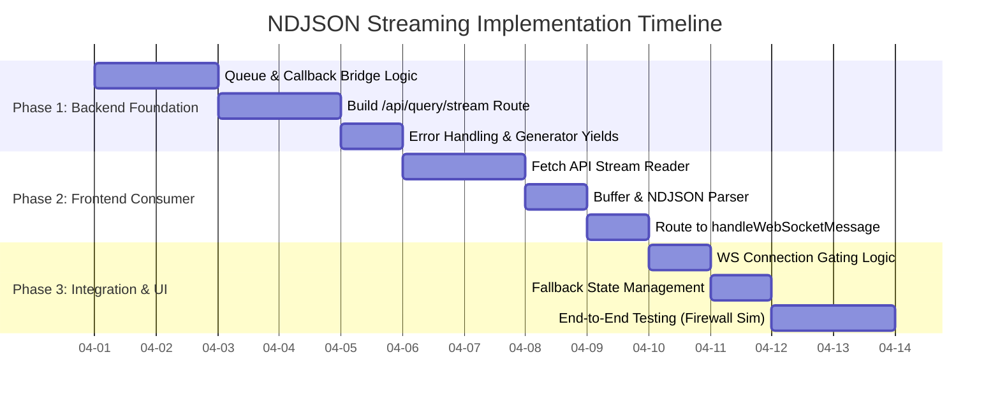

### **1\. Why isn't there a PROMPT INSPECTOR trace step for REDIS semantic caching?**

You are completely correct to point this out—it is a missing piece of telemetry in our recent instrumentation.

When DaiBai processes a query, one of its first checks is hitting the **Semantic Cache** (Redis) to see if a highly similar natural language request has already been translated into SQL. If it finds a match, it bypasses the LLM generation entirely, saving time and tokens.

The reason it doesn't show up in the Inspector Panel is simply that **we haven't wrapped the cache lookup in an emit\_trace callback yet**.

* **To fix this:** In daibai/core/agent.py, right before the agent queries the Redis semantic cache, we need to emit a trace with step\_name: "Semantic Cache Lookup" and status: "running". If a cache hit occurs, we emit status: "success" with the cached SQL. If a miss occurs, we emit status: "success" (Cache Miss) and proceed to the LLM generation steps.

### **2\. The Architecture of WebSockets vs. REST Fallbacks**

When we discussed "structural failures" and "REST fallbacks" earlier, it comes down to the reality of deploying enterprise web applications across unpredictable network environments.

**Why all requests *should* be WebSocket:**

WebSockets (ws:// or wss://) establish a single, persistent, two-way connection between the browser and the server. This is perfect for AI agents because the server can asynchronously "push" updates (like our Trace Cards, status spinners, and final SQL) to the client as soon as they happen, without the client having to ask for them. As you noted, the ideal architecture gates the "Send" button until the WebSocket confirms it is open.

**Why we need a REST fallback:**

In a perfect world, WebSockets never fail. In the real world, strict corporate firewalls, aggressive antivirus software, VPNs, and certain load balancers explicitly block or drop long-lived WebSocket connections.

If our application relies *only* on WebSockets, a user behind a strict corporate firewall would load the page, the WebSocket connection would fail to negotiate, and the "Send" button would remain disabled forever. The app would be dead.

**The REST/HTTP Architecture:**

Standard HTTP (REST) is universally allowed through firewalls (port 443). By having a REST fallback, if the frontend detects that the WebSocket connection failed or timed out, it switches to sending standard POST /api/query requests. The tradeoff is that standard REST is "Request \-\> Wait \-\> Response." The client asks a question, waits 10 seconds in silence, and gets the final answer all at once, losing the beautiful, real-time "Chain of Thought" execution traces we built for the Inspector Panel.

This leads us to the solution: **NDJSON Streaming over REST**, which allows us to push real-time trace events over a standard, firewall-friendly HTTP connection.

---

Below is the comprehensive architectural plan to implement this solution in the future.

# ---

**ARCHIVAL SPECIFICATION: NDJSON Streaming Fallback Architecture**

**FOREWORD**

*This document contains the finalized architectural specification for implementing NDJSON (Newline Delimited JSON) streaming over REST within the DaiBai application. It was designed to solve the problem of execution trace telemetry (the "AI Brain" / Inspector Panel) being lost when client network topologies (e.g., strict corporate firewalls) block standard WebSocket connections.*

*By utilizing HTTP chunked transfer encoding and an asynchronous generator, DaiBai can push real-time step-by-step trace events over a standard POST request. This document is archived here to preserve the research, risk assessment, and implementation strategy for future development sprints, ensuring the work is not lost while current priorities are addressed.*

## ---

**1\. Executive Summary**

**Objective:** Upgrade the existing REST fallback mechanism to support real-time execution tracing, ensuring feature parity with the WebSocket transport layer.

**Method:** Implement a new endpoint (POST /api/query/stream) returning application/x-ndjson. The frontend will use the fetch() API's ReadableStream to parse chunks and route them into the existing WebSocket message handler.

**Difficulty:** Medium

**Risk Level:** Low-to-Medium (Mitigated by leaving the legacy non-streaming /api/query endpoint fully intact).

## ---

**2\. Implementation Timeline**

## ---

**3\. Server-Side Architecture (Backend)**

The backend must bridge DaiBai's callback-based telemetry pipeline with an asynchronous HTTP generator.

### **3.1. The API Route (daibai/api/server.py)**

Create a new dedicated endpoint to prevent regressions on standard REST consumers.

Python

from fastapi.responses import StreamingResponse  
import asyncio  
import json

@app.post("/api/query/stream")  
async def query\_stream\_endpoint(req: QueryRequest, user: dict \= Depends(get\_current\_user)):  
    """Streaming REST fallback returning NDJSON."""  
      
    \# 1\. Create a queue to hold trace events as they occur  
    event\_queue \= asyncio.Queue()

    \# 2\. Define the callback that the Agent/Pipeline will call  
    async def trace\_callback(event\_type: str, payload: dict):  
        message \= {"type": event\_type, "content": payload}  
        await event\_queue.put(json.dumps(message) \+ "\\n")

    \# 3\. Create the async generator for the StreamingResponse  
    async def event\_generator():  
        \# Start the heavy lifting in a background task  
        task \= asyncio.create\_task(  
            run\_agent\_pipeline(req, user, callback=trace\_callback)  
        )  
          
        while True:  
            \# Yield chunks as soon as they hit the queue  
            try:  
                chunk \= await asyncio.wait\_for(event\_queue.get(), timeout=1.0)  
                yield chunk.encode("utf-8")  
                  
                \# Check if the pipeline sent the terminal 'done' signal  
                if json.loads(chunk).get("type") \== "done":  
                    break  
            except asyncio.TimeoutError:  
                if task.done():  
                    break \# Task finished without sending 'done' (error state)  
                      
        \# Await task to catch any unhandled exceptions  
        await task  
              
    return StreamingResponse(event\_generator(), media\_type="application/x-ndjson")

### **3.2. Backend Complications & Mitigations**

* **Branching Logic:** The run\_agent\_pipeline must accurately handle playground mode, meta-tables, and standard production paths, guaranteeing a terminal {"type": "done"} event is always emitted so the HTTP connection closes cleanly.  
* **Exceptions:** If the LLM times out or the database connection drops mid-stream, the exception handler must catch it and inject {"type": "error", "content": "..."}\\n{"type": "done"}\\n into the queue before the generator closes.

## ---

**4\. Client-Side Architecture (Frontend)**

The frontend app.js must be refactored to consume a continuous HTTP byte stream rather than waiting for an await response.json().

### **4.1. The Stream Consumer (app.js)**

When falling back to REST, sendMessage() will utilize the Streams API.

JavaScript

async function sendStreamingRestQuery(queryText) {  
    const response \= await fetch('/api/query/stream', {  
        method: 'POST',  
        headers: { 'Content-Type': 'application/json' },  
        body: JSON.stringify({ query: queryText })  
    });

    const reader \= response.body.getReader();  
    const decoder \= new TextDecoder("utf-8");  
    let buffer \= "";

    try {  
        while (true) {  
            const { done, value } \= await reader.read();  
            if (done) break;

            // Decode the byte chunk into text and add to our buffer  
            buffer \+= decoder.decode(value, { stream: true });

            // Split by newline to find complete JSON objects  
            let lines \= buffer.split('\\n');  
              
            // Keep the last partial line in the buffer  
            buffer \= lines.pop(); 

            for (const line of lines) {  
                if (line.trim() \=== '') continue;  
                  
                try {  
                    const parsedEvent \= JSON.parse(line);  
                    // Pass directly into the existing WebSocket UI logic\!  
                    handleWebSocketMessage(parsedEvent);   
                } catch (e) {  
                    console.error("Failed to parse NDJSON line:", line, e);  
                }  
            }  
        }  
    } finally {  
        reader.releaseLock();  
    }  
}

### **4.2. UI State & Connection Gating**

* **Initialization:** On load, the UI will attempt a WebSocket connection. The chat input \<textarea\> and Send button will remain disabled displaying "Connecting to AI Core...".  
* **Success:** If WS connects within 3 seconds, inputs are enabled.  
* **Fallback:** If WS fails or times out, a flag useRestStreamFallback \= true is set, a warning toast ("Real-time connection blocked. Using fallback mode.") is briefly shown, and the inputs are enabled.  
* **Routing:** When the user clicks "Send", the client checks the flag. If true, it routes the payload to sendStreamingRestQuery(); otherwise, it uses the standard WebSocket socket.send().

## ---

**5\. Risk Assessment Summary**

| Aspect | Level | Notes |
| :---- | :---- | :---- |
| **Backend Effort** | Medium | Requires refactoring pipeline into an asyncio.Queue / generator pattern. |
| **Frontend Effort** | Medium | Chunk boundary buffering (the lines.pop() logic above) is required. |
| **Regression Risk** | Low | By creating /stream, the legacy /api/query remains fully functional for internal scripts. |
| **Bug Risk** | Medium | Streaming edge cases (client disconnects mid-stream) require careful try/finally blocks on the server to prevent memory leaks. |

