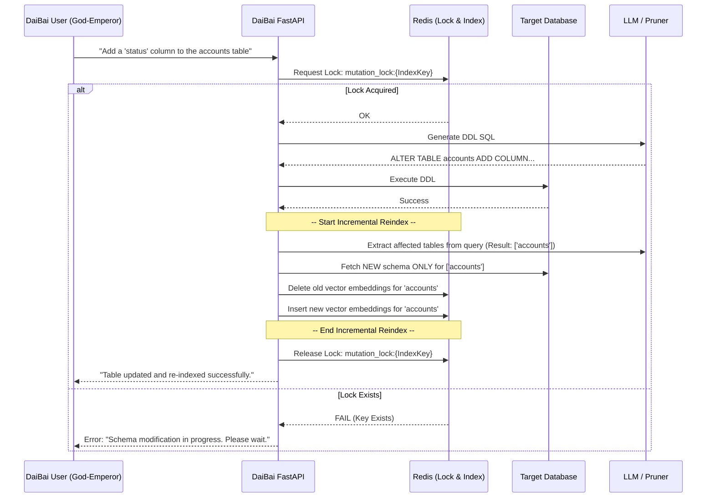

This is a robust set of requirements that represents a mature transition from a single-user prototype to an enterprise-grade multi-tenant SaaS application.

Given our planned architecture (Azure Cosmos DB for document storage, Azure Key Vault for secrets, and Redis for semantic caching/indexing), here is the architectural blueprint and data model to implement these requirements, along with a specific concurrency model for your "God-Emperor" mode.

---

### 1. User Configuration & Secrets Data Model (Reqs 1, 2, & 3)

We will use a split-storage model. **Cosmos DB** will hold the structural configuration (which databases and LLMs the user wants), but **Azure Key Vault** will hold the actual database passwords. DaiBai will stitch them together at runtime.

**Cosmos DB: `users` container**

```json
{
  "uid": "user_123_entra_id",
  "email": "amram@example.com",
  "preferences": {
    "default_llm": "gemini-2.5-pro",
    "theme": "dark"
  },
  "databases": [
    {
      "connection_id": "db_alpha_789",
      "alias": "On-Prem Accounting",
      "network_type": "on_prem", // 'on_prem', 'cloud', 'internet'
      "db_type": "mysql",
      "host": "192.168.1.50",
      "port": 3306,
      "database_name": "accounting_db",
      "db_username": "dbuser1",
      "kv_secret_reference": "kv-secret-user123-db-alpha-789" // Points to Azure Key Vault
    }
  ]
}

```

* **Req 1 (DBs):** Users can define as many databases as they want, categorizing them by network type.
* **Req 2 (LLMs):** The `default_llm` preference maps to your provider factories (Gemini, Azure OpenAI, Anthropic, Ollama, etc.).
* **Req 3 (Secrets):** The password is securely stored in Azure Key Vault under the name `kv-secret-user123-db-alpha-789`. Cosmos DB is never polluted with plaintext passwords.

---

### 2. Session & History Management (Req 4)

To store requests, responses, and historical contexts, we will utilize a dedicated `sessions` container in Cosmos DB. This enables users to look back at past queries and reload old contexts.

**Cosmos DB: `sessions` container**

```json
{
  "session_id": "sess_999",
  "uid": "user_123_entra_id",
  "created_at": "2026-03-05T10:00:00Z",
  "context": {
    "llm_provider_used": "gemini-2.5-pro",
    "database_used": "db_alpha_789"
  },
  "history": [
    {
      "timestamp": "2026-03-05T10:01:00Z",
      "request": "Get me the top 10 accounts by comments",
      "response_sql": "SELECT ...",
      "response_data_preview": "[...]", // Store a truncated JSON preview of results
      "trace_telemetry": {} // The AI Brain execution log
    }
  ]
}

```

---

### 3. Identity-Based Shared Indexing (Req 5.a)

Your requirement here is excellent: **Indexes should be tied to the database credentials, not the DaiBai user.** This perfectly respects the principle of least privilege, as different database users will have different schema visibilities.

**Implementation Strategy:**
Currently, DaiBai likely stores the Redis vector index under a key like `index:{database_name}`. We will change the namespace architecture to a deterministic hash of the connection parameters.

* **Index Key Generation:**
`IndexKey = Hash(db_type + host + port + database_name + db_username)`
* **The Result:** * User A and User B both use `dbuser1`. Their configurations compute the exact same `IndexKey`. They share the Redis vector space.
* User C uses `dbuser2`. The hash is different. Redis creates a completely separate semantic space for them, ensuring they only index and search the tables `dbuser2` has permissions to see.


---

### 4. God-Emperor Mode: Concurrency & Incremental Indexing (Req 5.b)

Allowing LLM-driven DDL (Data Definition Language) changes is incredibly powerful but highly volatile. If two users with `dbuser1` access try to ALTER the same table simultaneously, or if a user drops a table while the background indexer is trying to read it, the system will crash or corrupt the vector space.

Here is the proposed **Concurrency and Change Model**:

#### **A. The Distributed Lock Pattern (Mutex)**

Since our architecture already includes Redis, we will use Redis for **Distributed Locking**.

1. **The Mutation Lock:** Before DaiBai executes any God-Emperor DDL prompt (CREATE, ALTER, DROP), it must acquire a Redis Lock tied to the specific `IndexKey`.
* `SET mutation_lock:{IndexKey} "locked" NX PX 30000`


2. **Strict Blocking:** If another user (even the same user in a different tab) attempts to run a God-Emperor command while that lock exists, the DaiBai API immediately returns an HTTP 423 (Locked) or 409 (Conflict): *"Another administrator is currently modifying the schema or indexing is in progress. Please wait."*
3. **Read-Only Bypass:** Standard users running `SELECT` queries (standard DaiBai mode) **ignore** this lock. They can keep querying the existing data without interruption.

#### **B. The Execution & Incremental Reindex Flow**

To fulfill requirement 5.b.1 (incremental indexing) and 5.b.2 (no changes during reindex), the lock must span the entire lifecycle of the change.



#### **Why this Model Works:**

1. **Prevents Race Conditions:** By locking at the `IndexKey` level, it is physically impossible for two requests using the same database credentials to alter the schema simultaneously.
2. **Solves the Incremental Problem:** Because the LLM generates the DDL, we already know *exactly* which tables are being altered. The API passes that list of table names to the indexing function, telling it to only drop and rebuild vectors for those specific tables, rather than dropping the whole schema and starting over.
3. **Self-Healing:** By using a Redis lock with a `PX` (TTL/timeout) of say, 30 or 60 seconds, if the DaiBai server crashes mid-reindex, the lock automatically expires, preventing a permanent deadlock.